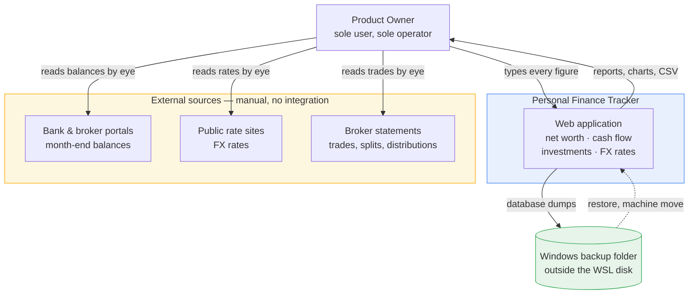
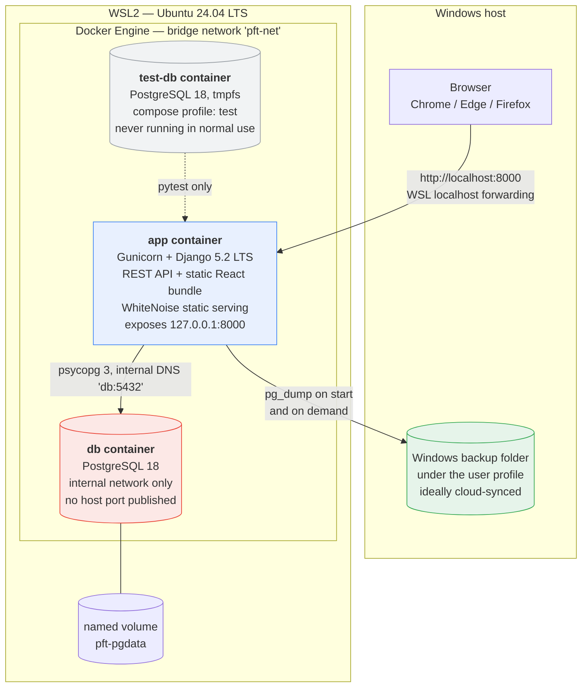
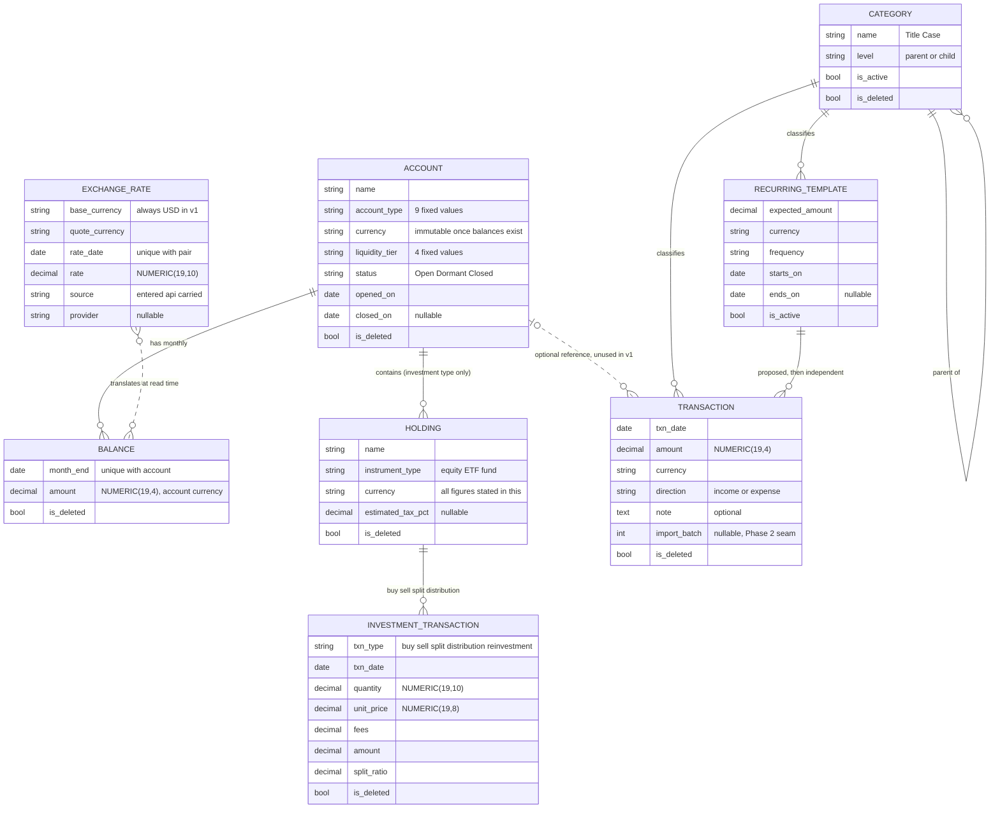
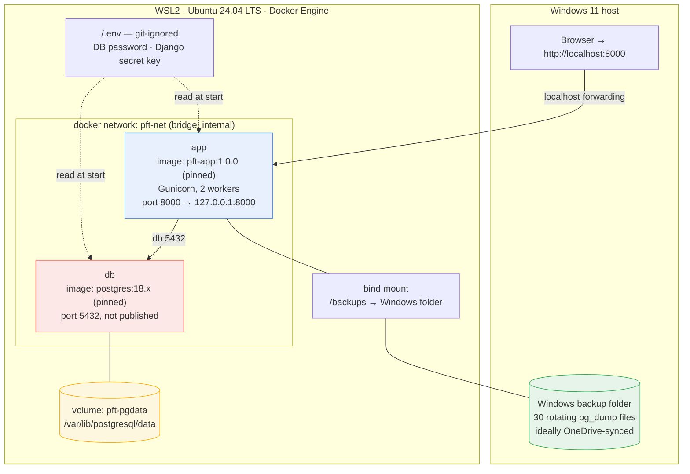

# High Level Design
## Personal Finance Tracker — Version 1.0

---

## 1. Document Control

| Field | Value |
|---|---|
| Document title | High Level Design — Personal Finance Tracker |
| Version | 1.0 |
| Date | 13 August 2026 |
| Author | Senior Software Architect |
| Owner | The Product Owner (sole stakeholder, sole user, sole developer) |
| Status | Draft for review |
| Implements | Business Requirements Document — Personal Finance Tracker, **version 1.0**, dated 13 August 2026 |
| Basis | Fifteen-area architecture interview covering the design decisions the BRD left open |
| Scope of authority | This document governs *how* the system is built. The BRD remains the source of truth for *what* it does. Where this document departs from the BRD, the departure is stated explicitly and justified. |
| Next review trigger | Completion of the "net worth usable" internal checkpoint (§11.7) |

### 1.1 Version history

| Version | Date | Author | Change |
|---|---|---|---|
| 1.0 | 13 Aug 2026 | Architect | First complete draft following close of the architecture interview |

### 1.2 Departures from the BRD recorded in this design

Five. Each is argued in the section named.

| # | BRD position | Design position | Where argued |
|---|---|---|---|
| D1 | CSV export is priority *Could* (FR-52, NFR-12) and may be dropped under A8 | **Promoted to Must** | ADR-11, §13.2 (OI-10) |
| D2 | Month completeness is binary — Complete or Incomplete (BR-03) | **Three states** — Outside Range, Missing, Incomplete | ADR-04 |
| D3 | Any record may be deleted (FR-53, BR-23) | Deletes are **soft**; account hard-delete restricted to accounts with no balances | ADR-03, ADR-14 |
| D4 | A lot carries a stored remaining quantity; a sale carries a stored cost basis and realised gain (§9.1) | Both are **derived by replay**, never stored | ADR-06 |
| D5 | Reporting screens are usable on tablet and phone (FR-54, NFR-09) | Layouts are responsive but **network access is localhost-only in v1**, so phone access is deferred | ADR-16, §12.4 |

D1, D2 and D3 strengthen the BRD's own stated intent. D4 is an implementation choice about where state lives, not a change to observable behaviour. D5 is a genuine reduction in delivered capability and is tracked as a deferral in §12 and §13.

---

## 2. Introduction

### 2.1 Purpose

This document describes the technical architecture of the Personal Finance Tracker: its structure, boundaries, key technical decisions, and the reasoning behind them. It is written to be sufficient for construction to begin without further architectural input, and to be intelligible in three years to a reader — most likely the author — who has forgotten why anything was decided.

### 2.2 Scope

**In scope.** Container and component structure; the data model at a conceptual level; the algorithms that produce financial figures; API surface and conventions; front end architecture; security posture; deployment, backup and restore; testing strategy; build sequencing; and the traceability of every BRD functional requirement to a component that satisfies it.

**Out of scope.** Implementation code, class designs, function signatures, table DDL, UI visual design, and any capability the BRD places outside version 1. Where this document approaches the boundary of low level design, the detail is explicitly deferred as an implementation concern.

### 2.3 Intended audience

The Product Owner, who is also the sole developer and sole user. The document assumes technical literacy but not architectural specialism: every decision that affects cost, effort, visible behaviour, data safety, or future flexibility is explained in plain terms rather than assumed.

### 2.4 Definitions

Business terms — account, balance, snapshot, month close, liquidity tier, lot, FIFO, realised gain, carry-forward rate, as-at date — carry the meanings given in BRD §6 and are not redefined here. Technical terms specific to this design:

| Term | Definition |
|---|---|
| **Replay** | Recomputing a holding's complete lot state and realised gains by processing its investment transactions in date order from the beginning, discarding any prior computed state. The only mechanism by which lot consumption is determined. |
| **Derived on read** | A figure computed at the moment it is requested, from stored facts, and never persisted. All aggregate figures in this system are derived on read. |
| **Stored fact** | A value entered by the user and persisted verbatim: a balance, a transaction, a rate, an investment transaction, an account classification. The only inputs to any calculation. |
| **Translation** | Converting an amount from one currency to another for display, using a rate from the rate table. Never mutates stored data. |
| **Triangulation** | Deriving an AUD↔MYR rate from the two stored USD-based rates. Computed on demand, never stored. |
| **Soft delete** | Marking a row as deleted so it disappears entirely from the application, while the row remains in the database and is recoverable by administrative means. |
| **One-way door** | A decision that cannot be reversed later without data migration or permanent information loss. Four exist in this design and are listed in §13.4. |
| **Service module** | A Python module holding business calculation logic, called by views, containing no HTTP concerns and no ORM query construction beyond what the calculation needs. |

---

## 3. Architectural Drivers

### 3.1 Ranked quality attributes

The ranking below was set deliberately in interview Area 1 and every subsequent decision was tested against it. Where two attributes conflict, the higher-ranked one wins.

| Rank | Attribute | What it means here | Design consequences |
|---|---|---|---|
| **1** | **Durability of hand-entered data** | Every figure in the system was typed by hand from a bank or broker screen. None of it can be regenerated from any other source. Years of it accumulate. | Soft deletes (ADR-03); dump on every container start; backups written outside the WSL virtual disk; backup age surfaced in the UI; migrations preceded by a dump |
| **2** | **Correctness and reproducibility of historic figures** | A net worth figure for March 2027 must return the same answer in 2030 unless its inputs were edited. Arithmetic must be exact, not approximately right. | Exact decimal storage and arithmetic (ADR-02); PostgreSQL in every environment including test; a single definition of each calculation; hand-verified scenario tests; a smoke test that asserts a known figure is unchanged after upgrade |
| **3** | **Low friction of the monthly close** | SC-01 is the BRD's own primary success criterion. The system fails if it is abandoned, regardless of feature completeness. | Autosave on the Month Close grid; keyboard-first entry; two FX rates per month rather than six; recurring transaction proposals; long session lifetime |
| **4** | **Ability to run untouched for years** | The system must not decay when ignored. No expiring credentials, no mandatory updates, no scheduled job that must fire. | All versions pinned; no scheduler dependency; no external service dependency in v1; synchronous processing only; Django LTS |
| **5** | **Report performance** | Ranked last deliberately. The ten-year dataset is approximately 20,000 rows. | Everything computed on read (ADR-05); no caching, no materialisation, no denormalisation |

The gap between ranks 2 and 5 is the most consequential fact about this design. Because the dataset is trivially small, correctness never has to be traded against speed. Almost every architectural temptation in a financial system — materialised balances, cached aggregates, denormalised reporting tables — exists to buy performance, and each one buys it by introducing state that can silently disagree with its inputs. None of them is needed here, and each one would have cost rank 1 and rank 2 to purchase rank 5.

### 3.2 Constraints

Constraints inherited from the BRD (CON-01 to CON-07) apply unchanged. Constraints established or refined by this design:

| ID | Constraint | Source |
|---|---|---|
| CON-08 | Ubuntu 24.04 LTS running under WSL2 on Windows, with Docker Engine | Architecture interview; revises CON-01's "local PC" |
| CON-09 | The application and its database volume must reside inside the WSL filesystem, never on a `/mnt/c` Windows mount | PostgreSQL file locking is unreliable across the WSL/Windows filesystem boundary |
| CON-10 | Backup artefacts must be written outside the WSL virtual disk, to a Windows-side folder | A WSL distro is a single virtual disk that can be corrupted or unregistered as a unit |
| CON-11 | `wsl --shutdown` terminates containers without a graceful stop signal | No design element may depend on shutdown-time behaviour |
| CON-12 | The machine is booted on demand, not always on | No correctness-relevant work may depend on a scheduled job firing |
| CON-13 | All library and image versions are pinned; updates occur only by deliberate act | Quality attribute 4 |
| CON-14 | Single developer, who is also the sole user and the sole tester | CON-03; sets the ceiling on acceptable complexity |

### 3.3 Assumptions

Assumptions carried unchanged from the BRD and still unconfirmed: **A6** (volume sizing), **A7** (build order is internal only), **A8** (MoSCoW is the sole scope control), **A9** (only USD, AUD and MYR are held), **A10** (balances are readily obtainable each month), **A11** (broker balances already reflect market value). These are tracked as BRD open issue OI-02 and are not resolved by this document.

Assumptions introduced by this design:

| ID | Assumption | Status | Consequence if wrong |
|---|---|---|---|
| AS-01 | Django 5.2 LTS formally supports PostgreSQL 18 | **Unverified — must be checked before build** | Fall back to PostgreSQL 17; one-line image change, no design impact |
| AS-02 | The Windows folder receiving backups is itself synchronised or copied off-machine | **Unconfirmed** | Backups survive a WSL failure but not a disk failure; RISK-02 only partially closed |
| AS-03 | The Product Owner will hand-verify the arithmetic scenarios in §11.5 before first live use | **Unconfirmed** | Coverage would be measured but correctness never independently established |
| AS-04 | Transaction volume stays within an order of magnitude of A6's 100 per month | Inherited from A6 | Compute-on-read remains comfortable to roughly 50× current sizing; beyond that, revisit ADR-05 |
| AS-05 | No fourth currency is introduced | Depends on OI-01 | Each additional currency adds one stored USD pair and one more rate to enter monthly |

### 3.4 Requirements the BRD leaves unimplementable or under-specified

Raised during the interview, resolved as shown, and recorded here so no reader has to rediscover them.

| Flag | Issue | Resolution |
|---|---|---|
| **F1** | Agenda Area 2 presumed a live choice between single- and double-entry, but the BRD deletes all three of double-entry's consumers — transfers (BR-11), FX conversions (decision 33), and investment settlement (BR-19) | Single-entry. ADR-01 |
| **F2** | Three BRD-derived design questions have no referent: the "snapshot-versus-derived precedence rule" (BR-01 states no such rule is needed), realised/unrealised FX gain (computed nowhere), and market price storage (no prices held) | Recorded as void; no design produced for them |
| **F3** | NFR-07 makes backup entirely external and invisible, while the only in-application data route (CSV export) is droppable under A8 — yet RISK-02 rates the impact Severe | Automated dump promoted into the design as a Must; CSV export promoted to Must. §11.2, ADR-11 |
| **F4** | FR-45 requires "the as-at date" on translated figures, but an aggregate may depend on three rates with three different dates | Oldest contributing date, shown only when stale, expandable to per-currency detail. ADR-09 |
| **F5** | BRD §9.2 removes any link between a transaction and an account — a one-way door that closes on first data entry | Optional account reference captured from day one, unused in v1. ADR-13 |
| **F6** | FR-53 permits deleting an account, destroying its entire balance history, while BR-06 already provides closure for every legitimate case | Hard delete permitted only before any balance exists. ADR-14 |
| **F7** | SQLite has no decimal type; a FIFO or aggregation test could pass in development and be wrong in production | PostgreSQL in every environment, including an isolated test container. ADR-02 |
| **F8** | FIFO is order-dependent, so BR-23's unrestricted historic editing can retroactively invalidate every subsequent sale — the BRD does not say what happens next | Full replay on every change; retroactively invalid states flagged, never blocked. ADR-06, ADR-07 |

---

## 4. Solution Overview

The system is a two-container application — a Django process serving both a REST API and a pre-built React bundle, and a PostgreSQL database — running under Docker inside a WSL2 Ubuntu distribution, bound to localhost, reached from a Windows browser. It stores only facts the user typed: monthly account balances, cash flow transactions, investment transactions, and exchange rates. It stores no computed figure anywhere. Every net worth total, every currency translation, every lot consumption and every realised gain is derived at the moment it is requested, by replaying stored facts through a single service module that owns that calculation's definition. This is affordable because the ten-year dataset is roughly twenty thousand rows, and it is valuable because it makes the BRD's unrestricted historic editing (BR-23) free rather than dangerous: there is no cached figure to invalidate, no materialised total to drift, and no way for a displayed number to disagree with the facts it came from. Around this core sit the operational guarantees that protect the data — dumps taken on every container start and written outside the WSL virtual disk, soft deletes that make a mis-click recoverable, and a restore procedure identical to the machine-move procedure so that it is rehearsed by ordinary use.

### 4.1 System context



The single most important feature of this diagram is the absence of any arrow between the external sources and the application. There is no integration of any kind: no bank API, no broker connection, no rate feed, no file import (BRD §4.2, CON-05, CON-06). Every arrow into the system passes through the user's eyes and keyboard. This is what makes the friction attribute rank 3 rather than an afterthought, and it is why the Month Close screen receives disproportionate design attention.

The only outbound arrow is the backup, and it is the only mechanism standing between the user and total loss of years of irreplaceable typing.

---

## 5. Architecture Views

### 5.1 Container view



**Two containers, and why not fewer or more.**

*Why not one container.* Folding PostgreSQL into the application container was considered for portability. Rejected: the two could no longer be restarted or upgraded independently; the data directory would sit inside an image rebuilt on every front end change, which is the most common way a database is destroyed during routine work; and the clean `pg_dump` story becomes muddier. Portability is not lost by separating them, because the unit that moves between machines is the compose file plus a dump file — a container image contains no data at all.

*Why not three.* A separate Nginx container is the conventional production pattern and was rejected: for a single local user it adds a third container and a configuration file to maintain for a decade, in exchange for capabilities — TLS termination, load balancing, multi-origin routing — that a localhost-bound single-user application does not use. Gunicorn with WhiteNoise serves the React bundle adequately at this scale. A separate Celery worker and Redis broker were rejected because no operation in this system takes long enough to warrant being backgrounded, and CON-12 makes scheduled work unreliable in any case. A separate backup container was rejected because the work is a single `pg_dump` invocation that an entrypoint script performs in five lines.

*Why the test database is a container and not SQLite.* Argued fully in ADR-02. It runs only under the `test` compose profile, uses `tmpfs` storage so it holds nothing between runs, and is configured with a deliberately dissimilar connection string so that a test run cannot address the production database.

### 5.2 Component view

```mermaid
graph TB
    subgraph FE["React front end — built by Vite, served as static files"]
        ROUTER["App shell &amp; router<br/>React Router · 10 BRD screens"]
        QUERY["Server state<br/>TanStack Query"]
        SETTINGS["Settings context<br/>reporting currency · date range<br/>mirrored into the URL"]
        FMT["Formatting module<br/>Intl wrappers · Money type<br/>no arithmetic defined"]
        GRID["Month Close grid<br/>TanStack Table headless<br/>plain inputs, keyboard-first"]
        CHARTS["Chart components<br/>Recharts"]
        SCREENS["Screens<br/>Dashboard · MonthClose · NetWorth<br/>AccountDetail · Accounts · CashFlow<br/>Categories · Investments · FX · Settings"]
    end

    subgraph BE["Django back end"]
        API["HTTP layer — DRF<br/>thin views · serializers<br/>shape validation only"]

        subgraph CORE["core"]
            MONEY["Money primitives<br/>amount + currency, inseparable"]
            TRANS["Translation service<br/>the only cross-currency path"]
            RATELOOK["Rate lookup service<br/>returns rate · as-at date<br/>· provenance · staleness"]
            COMPLETE["Completeness service<br/>Outside / Missing / Incomplete"]
            EXPORT["CSV export service"]
            OPS["Backup status service"]
            AUTH["Session auth · settings"]
        end

        subgraph ACC["accounts"]
            ACCMODEL["Account · Balance"]
            NW["Net worth service<br/>the single definition of BR-04"]
            SLICE["Slice services<br/>type · liquidity · currency · account"]
        end

        subgraph CF["cashflow"]
            CFMODEL["Category · Transaction<br/>RecurringTemplate"]
            CFRPT["Category reporting service"]
            RECUR["Recurring proposal service"]
        end

        subgraph INV["investments"]
            INVMODEL["Holding · InvestmentTransaction"]
            REPLAY["<b>FIFO replay engine</b><br/>pure function · no writes"]
            GAINS["Realised gains reporting<br/>per holding currency"]
        end

        subgraph FX["fx"]
            FXMODEL["ExchangeRate<br/>USD-based pairs only"]
            FXTREND["Rate trend service<br/>triangulation on demand"]
        end
    end

    DB[("PostgreSQL 18")]

    SCREENS --> QUERY
    QUERY -->|"JSON · money as strings"| API
    SCREENS --> GRID
    SCREENS --> CHARTS
    SCREENS --> FMT
    SCREENS --> SETTINGS

    API --> ACC
    API --> CF
    API --> INV
    API --> FX
    API --> CORE

    NW --> TRANS
    NW --> ACCMODEL
    NW --> COMPLETE
    SLICE --> NW
    TRANS --> RATELOOK
    RATELOOK --> FXMODEL
    GAINS --> REPLAY
    REPLAY --> INVMODEL
    CFRPT --> CFMODEL
    RECUR --> CFMODEL
    FXTREND --> FXMODEL
    EXPORT --> NW
    EXPORT --> CFRPT
    EXPORT --> GAINS

    ACCMODEL --> DB
    CFMODEL --> DB
    INVMODEL --> DB
    FXMODEL --> DB

    style CORE fill:#e8f0fe,stroke:#4285f4
    style REPLAY fill:#fce8e6,stroke:#ea4335
    style NW fill:#fce8e6,stroke:#ea4335
    style TRANS fill:#fce8e6,stroke:#ea4335
```



#### 5.2.1 Back end component responsibilities

| Component | Responsibility | Explicitly not responsible for |
|---|---|---|
| **HTTP layer (DRF)** | Routing, authentication enforcement, request/response serialisation, shape and type validation, consistent error formatting | Any financial calculation; any business rule |
| **core / Money primitives** | Representing an amount inseparably from its currency code; refusing arithmetic between differing currencies | Knowing what a balance or transaction is |
| **core / Translation service** | The single path by which any amount changes currency. Takes an amount, a target currency and a date; returns the translated amount together with the rate, its as-at date and its provenance | Deciding which date is appropriate — the caller supplies it |
| **core / Rate lookup** | Resolving a currency pair and date to a rate: exact match, carry-forward, or triangulation. Reports which of the three occurred, the as-at date, and whether the rate exceeds the staleness threshold | Storing derived rates; fetching rates from anywhere |
| **core / Completeness** | Determining the recorded month range, and each month's state: Outside Range, Missing, or Incomplete. Identifying which accounts are outstanding | Preventing any action; completeness is a status, never a prohibition |
| **core / CSV export** | Rendering any report's server-computed figures as CSV, honouring the active reporting currency and date range | Recomputing anything — it consumes the same services the screens do |
| **core / Backup status** | Reading the backup folder to report the newest dump's timestamp and size, and comparing it against the newest data modification timestamp | Performing backups — that is the container entrypoint's job |
| **accounts / Net worth service** | The single implementation of BR-04. Assembles active accounts for a month, applies dormant carry-forward, applies liability sign, translates each balance, and totals | Deciding presentation; suppressing change figures — the API layer applies that policy |
| **accounts / Slice services** | Grouping the net worth service's per-account output by type, liquidity tier, currency, or account | Any independent summation — every slice must total to the same net worth figure by construction |
| **cashflow / Category reporting** | Income and expense totals by child and parent category for a month or a range | Touching balances or net worth in any way |
| **cashflow / Recurring proposals** | Determining which templates have unconfirmed periods outstanding and presenting them | Creating any transaction automatically (BR-14) |
| **investments / FIFO replay engine** | Given a holding's transactions in date order, producing lot states, consumption, cost basis, realised gains, and any inconsistency. A pure function: transactions in, computed state out, no database writes | Persisting anything; knowing about currencies other than the holding's own |
| **investments / Realised gains reporting** | Presenting replay output grouped by holding currency, applying the estimated tax percentage to gains only | Combining currencies (BR-18); applying tax to losses (OI-05) |
| **fx / Rate trend** | Time series of stored rates for a pair, with triangulated pairs computed on demand and labelled as derived | Storing triangulated rates |

#### 5.2.2 The three-layer rule

Every Django app follows the same internal layering, and the rule is absolute because quality attribute 2 depends on it:

**Models** hold structure, relationships and database-enforced constraints. They contain no financial calculation. **Services** hold every business rule and every calculation, are callable without HTTP, and are where the test suite spends its effort. **Views** are thin: authenticate, deserialise, call one service, serialise, return.

The consequence worth stating is that there is exactly one place where net worth is defined, one place where translation happens, and one place where FIFO is computed. Every screen, every export and every dashboard panel reaches the same figure through the same code path. A design in which the dashboard computed its own summary — a common and superficially harmless shortcut — would permit the dashboard and the report to disagree, and the user would have no way to know which was right.

#### 5.2.3 Front end component responsibilities

| Component | Responsibility | Justification against doing without it |
|---|---|---|
| **App shell & router** | React Router over the ten BRD screens; reporting currency and date range held in the URL query string | Bookmarkable, refresh-survivable views. Matters when a reload happens mid-close |
| **TanStack Query** | Caching server responses; invalidating and refetching after every mutation | Hand-written `useEffect` fetching would require hand-written invalidation. With everything computed on read, a stale cache after an edit displays a wrong figure — the exact failure quality attribute 2 forbids |
| **Settings context** | Reporting currency and timezone, shared without prop-drilling | A state library (Redux, Zustand) was rejected: with server state handled above, the genuinely client-side state is a currency toggle and a date range |
| **Formatting module** | `Intl.NumberFormat` and `Intl.DateTimeFormat` wrappers; unambiguous date rendering (`13 Aug 2026`); a hand-written parser for pasted input such as `1,234.56` | `date-fns` and `dinero.js` were rejected: the browser already does this well, and quality attribute 4 argues against carrying dependencies for a decade that the platform supplies |
| **Month Close grid** | TanStack Table for column and virtualisation logic; plain `<input>` elements for entry; Tab advances to the next account; autosave fires on blur with a per-row saved indicator | TanStack Table is headless — it renders nothing — so keyboard-first entry is fully preserved. AG Grid was rejected as built for filtering thousands of rows rather than twenty fields of fast typing. Chosen over a hand-built table to support the Phase 2 multi-column accounts-over-time pivot |
| **Chart components** | Recharts: net worth trend with distinguished markers for incomplete months, stacked slice breakdowns, cash flow trend, rate trend | Confirms CON-02 from preference to decision. Chart.js rejected as imperative and awkward inside React; Nivo and Victory offer no advantage for these chart types |
| **Money type (TypeScript)** | A string-based type with no arithmetic operations defined | Makes "add two amounts in the browser" a compile error. JavaScript has no decimal type, so any front end arithmetic on money is a precision bug waiting for a large enough number |

### 5.3 Data view



**What is absent from this model is as deliberate as what is present.**

There is **no month table** — months are derived from the balances that exist (ADR-04). There is **no lot table** — lots are the buy transactions, and their remaining quantities are replayed rather than stored (ADR-06). There is **no stored realised gain** on a sale, and **no stored cost basis** — both are replay output. There is **no net worth table**, no monthly summary, no cached aggregate of any kind. There is **no link between a transaction and a balance**, because BR-12 makes cash flow a parallel ledger. There is **no link between a holding and a balance**, because BR-19 makes them independent. And there is **no audit table**, because NFR-06 says Won't — the soft-delete flag and the created/updated timestamps are diagnostic aids, not an audit trail, and no previous value of any field is retained.

Two relationships are drawn as dotted lines because they are deliberate non-relationships in v1: the optional account reference on a transaction is captured but never read (ADR-13), and the connection between exchange rates and balances exists only at read time inside the translation service, with no foreign key anywhere.

### 5.4 Deployment view



| Element | Choice | Rationale |
|---|---|---|
| **Network** | Single bridge network. Only the app publishes a port, and only to `127.0.0.1` | The database is unreachable from the host and from the LAN. Publishing 5432 would expose the data to anything on the network for no benefit |
| **Database storage** | Named Docker volume, not a bind mount | A bind mount into the WSL filesystem invites permission problems and tempts direct copying of a live data directory between machines, which is the least reliable way to move PostgreSQL data |
| **Backup storage** | Bind mount to a Windows folder | CON-10. Backups inside the WSL virtual disk die with it |
| **Startup ordering** | App waits on a database healthcheck | On a cold WSL boot the database is reliably slower to accept connections. Without this, the first `docker compose up` of every session appears to fail |
| **Secrets** | Single `.env`, git-ignored, with a committed `.env.example` | Docker secrets are Swarm machinery. Hardcoded defaults are how a secret key ends up in a repository permanently |
| **Image tags** | Fully pinned, including the PostgreSQL minor version | CON-13. Also the precondition for the rollback procedure in §11.4 |

---

## 6. Key Design Decisions

Eighteen Architecture Decision Records. Each states its context, the options considered, the decision, its consequences, and its reversibility. A decision with no rejected alternatives is not a decision, so every record names what was turned down and why.

Reversibility is graded: **Free** (a configuration change), **Cheap** (a code change, no data migration), **Costly** (a code change plus data migration), **One-way** (information is permanently lost by not deciding otherwise now).

---

### ADR-01 — Ledger model: single-entry

**Context.** The conventional choice for a financial system is double-entry, which makes transfers, FX conversions and investment settlements fall out naturally and renders the books self-checking, at the cost of conceptual complexity throughout the UI layer. This BRD, however, removes every consumer of that property: balances are entered snapshots rather than the sum of postings (BR-01); transfers between own accounts are not recorded at all (BR-11); currency conversions are explicitly out of scope (decision 33); and investment activity moves no balance (BR-19). A double-entry journal here would balance against nothing.

**Options considered.**

| Option | Assessment |
|---|---|
| (a) Single-entry — a transaction is one row; balances are a separate table of snapshots | **Chosen.** Matches the BRD's own model exactly. Nothing to hide in the UI |
| (b) Double-entry journal with balanced postings | Rejected. Self-checking against nothing; every entry screen would spend its life concealing a second leg the user never supplies and no report ever reads |
| (c) Double-entry confined to the investments module | Rejected. Investment transactions move no cash anywhere in this system, so there is no counter-account to post to |

**Decision.** Single-entry. Cash flow transactions, balance snapshots and investment transactions are three unrelated fact tables. Table boundaries are drawn so that a journal could be added later as an additional table rather than a restructuring of these.

**Consequences.** The four modules are genuinely decoupled, so an incomplete cash flow ledger can never corrupt net worth — which is precisely the property BR-12 asserts. Nothing in the system can cross-check anything else, so a typo in a balance is undetectable by construction. Most significantly, the system can report *that* net worth moved but not *why* (RISK-09), and closing that gap in future means adding a journal alongside the snapshots rather than modifying them.

**Reversibility.** Cheap to add a journal alongside; the snapshot model would remain untouched. Costly to reconstruct historic explanatory data, which would simply not exist.

---

### ADR-02 — Money representation, precision and database engine

**Context.** Quality attribute 2 requires that a figure computed today return the same answer in a decade. Financial arithmetic in binary floating point accumulates error silently across aggregation, and the errors are largest exactly where the numbers are largest. The database engine choice is inseparable from this, because it determines whether exact decimal arithmetic is available at all.

**Options considered — storage type.**

| Option | Assessment |
|---|---|
| (a) `NUMERIC(19,4)` — exact fixed-point decimal | **Chosen.** Four decimal places against three two-decimal currencies gives ample headroom for intermediate translation results |
| (b) Integer minor units (cents) | Rejected. Also exact, but every read and write needs scaling, and the values are unreadable in a database console during diagnosis |
| (c) Binary floating point | Rejected outright. Precision loss compounds across ten years of aggregation |

**Options considered — database engine.**

| Option | Assessment |
|---|---|
| (a) PostgreSQL 18 everywhere, including development and test | **Chosen** |
| (b) PostgreSQL in production, SQLite in development and test | Rejected — see below |
| (c) SQLite throughout | Rejected for the same reason, more so |
| (d) MySQL / MariaDB | Rejected. Capable, but offers no advantage here and has a fussier dump-and-restore story |

**Why SQLite was rejected even for development.** SQLite has no decimal type. A Django `DecimalField` maps to a column with NUMERIC affinity, which for any value with a fractional part is stored as an 8-byte IEEE float. Django converts it back to a `Decimal` on read, so it *looks* correct in Python, but the value has passed through binary floating point and every `SUM` the database performs is floating-point arithmetic. SQLite also ignores the declared `(19,4)` precision entirely, and its limited `ALTER TABLE` support means Django rebuilds tables during migration — so a migration can pass locally and fail against PostgreSQL. The net effect is that a FIFO cost-basis test or a ten-year aggregation test could pass in development and be wrong in production, which is the single failure mode this design exists to prevent. The development-speed benefit is real but small: a PostgreSQL container starts in about two seconds.

**Decision.** `NUMERIC(19,4)` for all monetary values; PostgreSQL 18 in every environment, with an isolated `tmpfs`-backed test container under a compose profile. Separate precisions for non-money quantities: unit quantities at 10 decimal places, unit prices at 8, exchange rates at 10 — because rounding a DRIP allocation to four places would corrupt cost basis cumulatively, and these scales cost nothing.

Every monetary value is stored as an amount column paired inseparably with a currency column, and all cross-currency aggregation is forced through the single translation service, which demands an explicit target currency. This makes "accidentally added AUD to MYR" structurally impossible rather than a bug awaiting the right afternoon. The same guarantee is extended into the browser by a TypeScript money type with no arithmetic operations defined on it.

**Rounding.** Full precision is carried through every calculation; rounding occurs only at display, to the currency's natural places, half-up. Rounding each component before summing was rejected as less accurate; banker's rounding was rejected because half-even produces results that look wrong to a human checking with a calculator.

**Consequences.** Arithmetic is exact and reproducible. Tests prove something about the system actually run. A visible cost: a column of displayed figures may occasionally appear to sum one cent away from its displayed total, because the total was computed at full precision and rounded once. Totals are therefore labelled as rounded rather than distorted to match.

**Reversibility.** Precision is Costly to change (data migration). Engine choice is Costly. The rounding policy is Cheap. AS-01 — Django 5.2's formal support statement for PostgreSQL 18 — must be verified before build; falling back to PostgreSQL 17 is Free.

---

### ADR-03 — History, editing and audit model: soft delete, no audit trail

**Context.** BR-23 requires that any record be editable or deletable at any time, in any period, with no month locking and no audit record. NFR-06 confirms no audit trail. Yet §9.3 concedes there is no undo and no in-application recovery, and quality attribute 1 ranks durability of hand-entered data above everything else. A mis-clicked delete of a balance entered from a statement no longer to hand is unrecoverable except by restoring a backup — which would discard every change made since.

**Options considered.**

| Option | Assessment |
|---|---|
| (a) Hard delete, exactly as the BRD describes | Rejected. A single mis-click destroys irreplaceable data, and recovery costs everything entered since the last dump |
| (b) Soft delete — rows marked deleted, invisible to the application, recoverable administratively | **Chosen** |
| (c) Full audit trail of every change with previous values | Rejected. NFR-06 explicitly says Won't, and it would add a table larger than the data it audits |

**Decision.** Every table carries a deletion flag. Deleted rows vanish completely from every screen, every report, every export and every calculation — the user's experience is precisely BR-23's. The rows remain in the database and are recoverable through the Django admin, which is enabled for exactly this reason. All history remains fully editable in place; corrections are in-place updates, not reversals. No previous value of any field is retained anywhere.

Every row additionally carries created-at and updated-at timestamps. These are **not** an audit trail — they record when, never what — but they cost nothing and are the difference between diagnosing an odd figure in a minute and guessing.

**Consequences.** BR-23's behaviour is delivered exactly, while a fat-fingered deletion becomes a one-minute administrative recovery instead of a full restore. Storage cost is negligible at 20,000 rows. Every query in the system must filter deleted rows, which is handled once through a default manager rather than remembered per query. NFR-06's substance holds: the system still cannot tell you what a figure used to be, only that a row was removed.

**Reversibility.** Free — hard delete could be reinstated by changing one manager. Adding a true audit trail later would be Cheap but would capture nothing retrospectively.

---

### ADR-04 — Reporting month and completeness model

**Context.** BR-03 defines a month as Complete when every active account has a balance, and Incomplete otherwise. BR-05 exempts back-dated months entirely. The interview established a rule the BRD does not contain: the recorded range runs from the earliest month with any data to the present, and a hole *inside* that range is a defect to be surfaced — so back-dating June 2026 when August 2026 already exists does not merely add June, it exposes July as a gap. The BRD's binary status cannot express this: July is neither Complete nor merely Incomplete, it is absent.

**Options considered — storage.**

| Option | Assessment |
|---|---|
| (a) Months derived from the balances that exist; no month table | **Chosen.** At 120 months and 2,400 balances, computing completeness on demand is instantaneous and can never be stale |
| (b) A month row carrying its completeness status | Rejected. Would need recomputing whenever any balance, account status or classification changed, and would silently drift when a trigger was missed |
| (c) Hybrid, storing only anomalous months | Rejected. All the staleness risk of (b) for a fraction of the benefit |

**Options considered — status model.**

| Option | Assessment |
|---|---|
| (a) Binary Complete / Incomplete, per BR-03 | Rejected. Cannot express a gap inside the recorded range |
| (b) Three states — Outside Range, Missing, Incomplete | **Chosen** |

**Decision.** No month table. A single completeness service derives the recorded range and each month's state: **Outside Range** (earlier than the first recorded month — invisible and exempt, per BR-05), **Missing** (inside the range with no data at all), **Incomplete** (inside the range with some active accounts unfilled). A back-filled gap month must be brought to full completeness, not merely populated — every account active that month requires a balance.

Two supporting rules make this workable. An account is required only from the **later** of its opening date and the first month a balance was actually recorded for it — without which, adding an account with an honest 2015 opening date would retroactively break a decade of months. And completeness is always a **visible status, never a functional prohibition**: an Incomplete month remains fully viewable, reportable and exportable, carrying its status with it.

**Consequences.** The status can never be stale. The gap case is expressible and surfaced in outstanding tasks. But back-filling becomes all-or-nothing per month: reconstructing June when July needs eighteen balances means finding all eighteen. Given that the spreadsheet being retired is described as lossy, there may be months that cannot be completed, in which case the honest outcome is not to back-date past that point.

**Reversibility.** Free — relaxing gap months to "any data closes the gap" is a one-line change in one service, and is anticipated if the rule proves too rigid in practice.

---

### ADR-05 — Balance and net worth computation: derived on read, always

**Context.** BR-01 makes balances stored facts; net worth is an aggregate over them with currency translation applied. The conventional performance move is to materialise monthly totals. The BRD's own agenda anticipated a "snapshot-versus-derived precedence rule" — but BR-01 states outright that no such rule is required, since nothing is ever derived into a balance. That question is therefore void (flag F2), and this ADR addresses only where aggregate figures live.

**Options considered.**

| Option | Assessment |
|---|---|
| (a) Compute everything on read; store no derived figure anywhere | **Chosen** |
| (b) Materialise monthly net worth totals, refreshed on change | Rejected. Every edit to a historic balance, rate, account type or liquidity tier would have to trigger a correct recompute — and a missed trigger produces a wrong number that looks authoritative |
| (c) Hybrid with a scheduled recompute job | Rejected. CON-12 makes scheduled work unreliable on a boot-on-demand machine, and a figure that is correct only after a job has run is not a figure that can be trusted |

**Decision.** No computed figure is persisted anywhere in the system — not net worth, not slice totals, not month-on-month change, not lot remaining quantities, not cost basis, not realised gain. A full ten-year net worth trend touches roughly 2,400 balances and a few thousand rates: a single indexed query, comfortably inside NFR-03's two-second target with substantial margin. All aggregation happens in the database through ORM annotations rather than by loading rows into Python and summing, keeping decimal arithmetic inside the engine that guarantees it.

**Consequences.** BR-23's unrestricted historic editing becomes free rather than dangerous: there is no cache to invalidate and no materialised total to drift out of step. A whole class of stale-figure bug is eliminated rather than managed. The cost is that report latency grows with history — acceptable to roughly fifty times the current sizing (AS-04), beyond which a cache becomes justified. Because caching is a pure addition rather than a restructuring, deferring it costs nothing.

**Reversibility.** Cheap. Adding a cache or materialised table later requires no change to the stored model.

---

### ADR-06 — Cost basis implementation: FIFO by full replay

**Context.** FIFO is a *sequence*, not a set of independent rows. Every sale's cost basis depends on which lots existed and how much of each remained at that instant. BR-23 guarantees any historic investment transaction can be edited or deleted — so correcting a January purchase quantity in June retroactively changes March's realised gain, and every sale after it. The BRD does not say what happens next (flag F8). BRD §9.1 describes a lot as carrying a stored remaining quantity, and a sale as carrying its computed cost basis and realised gain.

**Options considered.**

| Option | Assessment |
|---|---|
| (a) Store lot remaining quantities and computed gains; mutate them as transactions are recorded | Rejected. This is §9.1 read literally, but it makes order-dependent state mutable, and after any historic edit the stored state can disagree with the transactions that produced it, with nothing to detect the disagreement |
| (b) Recompute forward from the edited date only | Rejected. Faster, but the correctness argument is subtler and the saving is meaningless at a few hundred transactions per holding |
| (c) Full replay of the holding from the beginning on every read | **Chosen** |

**Decision.** Lot state is never stored. The FIFO replay engine is a pure function: given a holding's transactions in date order, it produces lot states, consumption, cost basis, realised gains, and any inconsistency — performing no database writes. A "lot" is simply a buy transaction; its remaining quantity is replay output. A sale's cost basis and realised gain are replay output. This is departure D4 from the BRD: §9.1's attributes are honoured as concepts, not as stored columns.

Stock splits are transactions in the sequence, not edits to lots. A 2:1 split dated March correctly doubles a February lot and leaves an April lot alone — a property that (a) loses the moment a purchase is back-dated across a split, and that cannot be recovered once quantities have been destructively rewritten.

**Consequences.** Lot state can never disagree with the transactions, because it has no independent existence. Editing history is safe by construction. The engine is testable in isolation against hand-worked examples, which is the only basis on which cost-basis arithmetic deserves trust. The visible cost is that an edit can silently change a realised gain already viewed — mitigated by showing a before-and-after whenever a replay alters a previously reported figure.

**Reversibility.** Cheap. Materialising replay output as a cache would be additive. Replacing FIFO with specific-lot identification (RISK-07, likely if Australian CGT reporting ever comes into scope) requires a lot-selection field on sales and a change to one function — the transaction record itself is unaffected, which is precisely why lot-level tracking was worth preserving.

---

### ADR-07 — Retroactively invalid investment state: flag, never block

**Context.** FR-33 rejects a sale of more units than are held. But under BR-23, a sale of 100 units in March remains recorded when a January purchase is later reduced to 50 — the sale becomes invalid retroactively, after the fact and through no action on the sale itself.

**Options considered.**

| Option | Assessment |
|---|---|
| (a) Permit the edit, flag the holding as inconsistent with a clear statement of which sale is over-sold, block nothing | **Chosen** |
| (b) Block any edit that would create an inconsistency | Rejected. Traps the user when correcting two related errors in sequence — the first correction cannot be made until the second is, and vice versa |
| (c) Permit it silently and allow quantities to go negative | Rejected. Produces plausible-looking wrong figures |

**Decision.** FR-33's rejection applies at the point of entering a sale. Retroactive invalidity is a visible state of the holding, explained specifically, blocking nothing, and clearing itself when the underlying inconsistency is corrected. Realised gains for an inconsistent holding are shown with the inconsistency attached rather than suppressed.

**Consequences.** A holding may sit visibly broken until the user fixes it, which is better than being unable to correct a typo. This is the same philosophy as ADR-04's treatment of month completeness: the system reports problems, it does not obstruct.

**Reversibility.** Free.

---

### ADR-08 — FX rate storage: USD-based pairs with triangulation

**Context.** Three currencies are in use. A full pair table means six rates per date (USD↔AUD, USD↔MYR, AUD↔MYR); at month-end entry that is six figures to source and type every month, against quality attribute 3. Worse, independently entered pairs can silently disagree with one another, producing a net worth that depends on which route the translation took.

**Options considered.**

| Option | Assessment |
|---|---|
| (a) Store USD-based pairs only; derive AUD↔MYR by triangulating through USD | **Chosen** |
| (b) Store every pair explicitly | Rejected. Three times the monthly typing, and pairs can contradict each other |
| (c) Store USD pairs, require an explicit AUD↔MYR rate when reporting in those currencies | Rejected. Reintroduces both problems for the reporting currencies most likely to be used |

**Decision.** Two rates per month-end: USD/AUD and USD/MYR. AUD↔MYR is triangulated on demand and **never stored**, because storing a derived rate creates a second copy that can disagree with its inputs after an edit. Triangulated rates are labelled as derived wherever they appear.

Rates are entered in **market convention per pair** — AUD as USD per 1 AUD (e.g. 0.66), MYR as MYR per 1 USD (e.g. 4.20) — matching what the user reads off any rate site, with the inverse displayed live as they type so a wrong-way entry is immediately obvious. Forcing a single internal direction was rejected as requiring mental inversion before typing; letting each entry declare its own direction was rejected as inviting a silent inversion that misvalues an entire month.

Only month-end rates are required, and they are prompted during Month Close. Any other date is optional and exists solely to enrich the rate trend chart. Genuinely daily entry — roughly sixty figures a month by hand — was rejected as fatal to SC-01.

A non-blocking warning fires when a new rate differs from the previous entry for that pair by more than a configurable percentage (default 10%), in the same spirit as FR-23's duplicate warning. A misplaced decimal on a rate misstates every foreign balance for that month and nothing else in the system would catch it.

Every rate row carries a **source** (`entered`, `api`, `carried`) and a provider field from day one. Without these, the Phase 2 rate API could not distinguish hand-typed rates from fetched ones, could not honour BRD §4.3's requirement that manual entry override the API, and could not safely re-fetch a date. Rate ingestion sits behind a single interface with one v1 implementation, so the API becomes a second implementation rather than a rewrite.

**Consequences.** Two figures per month instead of six. Internal consistency is guaranteed by construction. A triangulated AUD↔MYR rate will not exactly match a quoted market rate for that pair — immaterial for personal net worth, and surfaced as derived rather than concealed. The rate trend chart will be sparse unless extra dates are entered voluntarily, which it will show honestly as a line through the dates that exist.

**Reversibility.** Cheap. Adding stored direct pairs later is additive; a fourth currency (AS-05) adds one stored pair.

---

### ADR-09 — As-at date presentation and rate staleness

**Context.** FR-45 requires the as-at date of the rate actually used to be displayed alongside every translated figure, and BR-09 permits carry-forward without limit. But a net worth total may depend on three rates with three different as-at dates, so "the as-at date" has no single answer for an aggregate (flag F4). Separately, RISK-05 notes that unlimited carry-forward means a month-end can be valued at a rate entered weeks earlier, moving reported net worth on stale data, with the as-at display as mitigation rather than fix.

**Options considered — aggregate display.**

| Option | Assessment |
|---|---|
| (a) Show the oldest contributing rate date as the headline, expandable to per-currency detail, and stay silent when every rate is fresh | **Chosen** |
| (b) Show all contributing dates inline on every figure | Rejected. Accurate but cluttered everywhere, including the common case where nothing is stale |
| (c) Show nothing unless it differs from month-end | Rejected alone, adopted as a component of (a) |

**Options considered — carry-forward limit.**

| Option | Assessment |
|---|---|
| (a) Unlimited carry-forward with a configurable staleness threshold (default 7 days) raising a visible flag and an outstanding task | **Chosen** |
| (b) Unlimited and silent beyond the as-at display — the BRD as written | Rejected. Leaves RISK-05 wholly unmitigated |
| (c) Refuse to translate beyond a hard limit | Rejected. Would make net worth uncomputable because of a lapse in typing |

**Decision.** Translated figures are silent when every contributing rate is fresh. When any is stale, the figure carries the **oldest** contributing as-at date, expandable to per-currency detail. This deliberately errs toward overstating staleness — a headline driven by one stale minor currency is the safe direction of error. Currencies exceeding the threshold appear in the dashboard's outstanding-tasks panel.

Rate lookup returns four facts together — the rate, its as-at date, its provenance (exact, carried, or triangulated), and whether it breaches the staleness threshold — because every translated figure in the system needs all four to satisfy FR-45 and NFR-14, and computing them separately per screen invites inconsistency.

Where no rate exists on or before the required date, FR-46 applies unchanged: affected accounts are excluded from the translated total, the omission is stated explicitly, and the balance is never treated as zero.

**Consequences.** NFR-14's transparency requirement acquires a concrete expression. A silent misstatement becomes a visible task. Clean months show no clutter.

**Reversibility.** Free — thresholds and presentation are configuration and view logic.

---

### ADR-10 — Container topology and application serving

**Context.** The BRD fixes React, Django and Docker on a local PC. It does not fix how many containers, how the front end is served, or whether anything runs asynchronously. Portability across devices was raised as a priority during the interview.

**Options considered — serving.**

| Option | Assessment |
|---|---|
| (a) Build React to static files at image build time; Gunicorn serves both API and bundle on one port | **Chosen** |
| (b) Separate Nginx reverse proxy container | Rejected for v1. The conventional production pattern, but a third container and a config file maintained for a decade in exchange for TLS termination, load balancing and multi-origin routing — none of which a localhost-bound single-user application uses |
| (c) Run Vite's dev server permanently | Rejected. Not a thing to depend on for years |

**Options considered — asynchrony.**

| Option | Assessment |
|---|---|
| (a) Nothing asynchronous; every operation a synchronous request | **Chosen** |
| (b) Celery plus Redis | Rejected. Two more containers with nothing to do. No operation here takes long enough, and CON-12 makes scheduling unreliable |

**Decision.** Two containers: `app` (Gunicorn, Django, WhiteNoise-served React bundle) and `db` (PostgreSQL 18). One port, one URL. Nothing asynchronous; the only scheduled work is the backup, performed by the container entrypoint rather than by Django. Four Django apps mirroring the BRD's modules — `accounts`, `cashflow`, `investments`, `fx` — plus `core` for the money, translation, rate lookup and completeness primitives, which makes BR-12's decoupling structural rather than a promise.

Django admin is enabled at a non-obvious path as a break-glass tool, principally to make ADR-03's soft-delete recovery reachable without writing SQL.

**Consequences.** Deployment is `docker compose up` with nothing to configure. The front end can never drift out of sync with the back end because they ship in one image. Changing the front end requires an image rebuild, which is acceptable when deployment is a deliberate act. The Phase 2 proxy seam costs nothing to preserve: keep the app port configurable and avoid absolute URLs in the front end.

**Reversibility.** Free to add a proxy; Cheap to split containers further.

---

### ADR-11 — Data survival: backup, export and restore

**Context.** This is the decision most directly serving quality attribute 1, and the BRD leaves it in an indefensible state (flag F3). NFR-07 makes backup entirely external and invisible to the system; the only application-level data route is per-report CSV export, priority *Could* and droppable under A8; meanwhile RISK-02 rates the impact of data loss as Severe. The runtime environment compounds this: a WSL2 distribution is a single virtual disk that can be corrupted or unregistered as a unit, and `wsl --shutdown` gives containers no graceful stop (CON-11), so shutdown-triggered backup is unreliable.

**Options considered — trigger.**

| Option | Assessment |
|---|---|
| (a) Manual dump after each close | Rejected. Depends on remembering at exactly the moment the data is most valuable |
| (b) Dump on container start, plus on demand | **Chosen.** Fits boot-on-demand exactly: every session begins by preserving the state the last session ended in |
| (c) Nightly scheduled dump | Rejected as the primary mechanism — worthless on a machine that may be off at night (CON-12). Retained as a bonus if the machine happens to be running |
| (d) Continuous archiving or a replica | Rejected. Substantial operational complexity for a system that changes a few dozen rows a month |

**Decision.** Four mechanisms, together closing RISK-02 by construction rather than by intention:

1. **Timestamped compressed `pg_dump` custom-format files**, one per run, last 30 retained and older pruned. Roughly a megabyte each at this volume. Plain SQL dumps were rejected as larger and slower to restore; filesystem copies of the data directory were rejected as unreliable while PostgreSQL is running.
2. **Written to a Windows-side folder** outside the WSL virtual disk (CON-10), ideally one already cloud-synchronised (AS-02).
3. **Backup age surfaced in the application.** The dashboard shows the newest dump's timestamp and size, and warns when the newest dump is older than the newest data change. A silent backup failure is otherwise indistinguishable from success until the day it matters.
4. **CSV export promoted from *Could* to Must** (departure D1), generated server-side so exports carry exactly the figures the server computed rather than rounded display values. This resolves OI-10. Note the division of labour: the dump handles disaster recovery; CSV export handles portability and the ability to take data elsewhere.

**Restore** is a documented one-command procedure, deliberately identical to the machine-move procedure — copy the repository, copy the `.env`, copy the latest dump, `docker compose up`, restore. Because moving to a new machine and recovering from disaster are the same procedure, every machine move rehearses the restore for free, which converts AD-03's "rehearse once" from a chore into something done anyway. An in-application restore button was rejected: it places a privileged destructive operation behind a single local password and adds a code path that is catastrophic when wrong.

**Consequences.** DEP-02 is satisfied by the system rather than assumed of the user. The maximum data loss window is one session. AS-02 remains the residual exposure: if the Windows folder is not itself copied off-machine, a disk failure still takes both copies.

**Reversibility.** Free.

---

### ADR-12 — API shape and where aggregation happens

**Context.** Reporting endpoints could return raw facts for the browser to aggregate, or finished figures. JavaScript has no decimal type.

**Options considered.**

| Option | Assessment |
|---|---|
| (a) Purpose-built read endpoints returning finished figures; the server sums, translates and rounds | **Chosen** |
| (b) Generic REST resources returning raw balances and rates, aggregated in the browser | Rejected. Would put the net worth definition in two places and perform decimal arithmetic in JavaScript floats — reintroducing exactly the precision problem ADR-02 eliminates |
| (c) Hybrid | Rejected. Inherits (b)'s exposure without (a)'s clarity |

**Decision.** Reporting endpoints are purpose-built queries, not resources. All monetary values cross the API as **strings**, never JSON numbers, always paired with a currency code — `JSON.parse` turns a number into a float, whereas a string survives intact and forces the front end to treat money as opaque text for display. No API versioning: both ends ship in one image and change together; a `/v1/` prefix can be added in one place later if a second client ever exists.

A single consistent error shape from every endpoint, rendered inline against the offending field with non-field problems as a banner. Free-text messages per endpoint were rejected as making every screen handle errors differently; a full RFC 9457 problem-details implementation was rejected as more ceremony than one user needs.

Serializers perform shape and type validation; services perform business-rule validation. No pagination on report endpoints — a ten-year net worth series is 120 rows — and cursor pagination on transaction lists, where twelve thousand rows accumulate.

**Consequences.** A new report means a new endpoint rather than a front end change, which is the correct trade when correctness ranks above flexibility. The browser cannot produce a figure the server did not compute, so a screen and an export can never disagree.

**Reversibility.** Cheap.

---

### ADR-13 — Optional account reference on cash flow transactions

**Context.** BRD §9.2 states that no relationship exists between transactions and accounts, deliberately, following from BR-12. OI-03 flags that this permanently prevents any future per-account cash flow analysis, and recommends capturing an optional reference now because it cannot be added retrospectively to historic rows.

**Options considered.**

| Option | Assessment |
|---|---|
| (a) Optional account reference on every transaction, captured but unused in v1 | **Chosen** |
| (b) Omit it, per §9.2 as written | Rejected. Permanently forecloses an analysis that cannot be reconstructed |
| (c) Make it mandatory | Rejected. Adds a required field to every entry, taxing quality attribute 3 directly |

**Decision.** A nullable account reference and a nullable import-batch reference are both captured from day one. Neither is read by any v1 report. The import-batch reference exists so that a Phase 2 bad import can be identified and rolled back as a unit rather than deleted row by row.

**Consequences.** One optional dropdown that may be ignored entirely, and two nullable columns. In exchange, two Phase 2 capabilities remain open that would otherwise be permanently closed for all historic data.

**Reversibility.** **One-way.** Deciding otherwise now loses the information permanently for every transaction entered before the decision is revisited.

---

### ADR-14 — Account deletion narrowed to accounts with no history

**Context.** FR-53 permits deleting any record including an account, which would destroy its entire balance history in one action. BR-06 already provides closure as the intended lifecycle path, preserving history while excluding the account from subsequent months (flag F6).

**Options considered.**

| Option | Assessment |
|---|---|
| (a) Hard delete permitted only while an account has no recorded balances; once history exists, closure is the only route | **Chosen** |
| (b) Hard delete always, per FR-53 literally | Rejected. Deleting an account with years of balances has no legitimate use that closing it does not serve better |
| (c) Hard delete behind a confirmation dialogue | Rejected. Confirmation dialogues are dismissed reflexively; this is a rank-1 concern |

**Decision.** Accounts created in error can be removed cleanly. Accounts with history can only be closed. Note that ADR-03's soft delete means even a permitted account deletion is administratively recoverable.

**Consequences.** FR-53 is narrowed for one entity type. Recorded as departure D3 and reflected in the traceability table.

**Reversibility.** Free.

---

### ADR-15 — Front end stack

**Context.** React is fixed. Library choices around it are open, and CON-02 records Recharts as an unconfirmed preference rather than a requirement.

**Decision and rejected alternatives.**

| Concern | Chosen | Rejected, and why |
|---|---|---|
| Charting | **Recharts** — confirms CON-02 from preference to decision | Chart.js: imperative and awkward inside React. Nivo, Victory: comparable with no advantage for these chart types |
| Server state | **TanStack Query** | Manual `fetch` in `useEffect`: no dependency, but hand-written cache invalidation — and with everything computed on read, a stale cache after an edit displays a wrong figure. Redux Toolkit Query: equivalent, drags in Redux otherwise unneeded |
| Client state | **React state plus one settings context** | Zustand, Redux: the genuinely client-side state is a currency toggle and a date range |
| Tables | **TanStack Table (headless)** | AG Grid: built for filtering thousands of rows, not twenty fields of fast typing. Hand-built table: adequate for v1 but would not support the Phase 2 accounts-over-time pivot. Headless means plain `<input>` elements are retained, so keyboard-first entry is fully preserved |
| Formatting | **Browser `Intl`, wrapped in one module** | `date-fns` plus `dinero.js`: the platform already does this well, and quality attribute 4 argues against decade-long dependencies for supplied functionality |
| Build | **Vite, bundled into the app image** | Webpack: slower, more configuration, no benefit |
| Language | **TypeScript, with a money type having no arithmetic** | Plain JavaScript: loses the compile-time guarantee that is the front end half of ADR-02 |

**Month Close entry** receives specific treatment because SC-01 lives or dies there: twenty rows, prior balance shown alongside each input, Tab advancing to the next account, autosave on blur with a per-row saved indicator. Batch save behind one button was rejected because an interruption mid-close should not cost the entry, and because a partial month is a legitimate state (Incomplete) rather than an error — so atomicity buys nothing.

Reporting currency and date range are held in the URL query string, making any view bookmarkable and refresh-survivable.

**Reversibility.** Cheap for every item.

---

### ADR-16 — Security posture and network binding

**Context.** The threat model is narrow and worth stating plainly: the system is not internet-facing (NFR-02), holds no credentials or card numbers, and stores unencrypted data on a physically controlled machine (NFR-05). Authentication protects against someone else at the keyboard and against another device on the home network — not against a determined attacker holding the laptop.

**Options considered — binding.**

| Option | Assessment |
|---|---|
| (a) Bind to `127.0.0.1` only | **Chosen for v1** |
| (b) Bind to `0.0.0.0` for phone and tablet access | Rejected for v1. Would satisfy FR-54 and NFR-09, but exposes an unencrypted HTTP service secured by a single password to every device on the network. WSL2 additionally requires a Windows port-proxy rule, so it is not free either |
| (c) `0.0.0.0` with a self-signed certificate | Rejected. Certificate warnings on every device forever |

**Decision.** Django session authentication with an HttpOnly cookie; JWT in local storage was rejected as readable by any script while buying nothing without a mobile app, and HTTP basic auth was rejected as re-prompting constantly. Session lifetime 30 days with no idle timeout, because a re-login prompt mid-close is friction against quality attribute 3 on a machine already trusted. Bound to `127.0.0.1`. Secrets in a single git-ignored `.env` with a committed example template. Database port not published at all. No encryption at rest, per NFR-05.

**Consequences.** FR-54 and NFR-09 are **deferred**: responsive layouts are built and function under browser resize, but the application is unreachable from a phone until the Phase 2 reverse proxy exists. This is departure D5, tracked in §12 and §13. The residual accepted risk is that anyone reaching the unlocked browser session reaches the finances — appropriate for a single-user machine, and the reason session lifetime is a decision rather than a default.

**Reversibility.** Free — binding and session lifetime are configuration.

---

### ADR-17 — Testing strategy

**Context.** Quality attribute 2 requires the numbers to be trustworthy, and CON-14 means the developer, the user and the tester are the same person — so the strategy must be one person can sustain.

**Options considered.**

| Option | Assessment |
|---|---|
| (a) Uniform coverage target across the codebase | **Chosen** as the floor, at the Product Owner's direction |
| (b) Weighted — near-exhaustive on the financial core, thin elsewhere | Not chosen, but its substance is retained through the named-edge-case requirement below |
| (c) Manual testing only | Rejected. Cannot detect a regression in a figure last checked two years ago |

**Decision.** 80% line coverage enforced across the codebase, **plus** an explicit requirement that the financial core cover every documented edge case in BR-09 (rate carry-forward and absence), BR-16 (FIFO partial consumption, over-sale, fee treatment) and BR-20 (splits across lots, reinvestment) by name.

The reason for the addition is that coverage measures *lines executed*, not *arithmetic proven*: a FIFO replay can reach 100% coverage from a single simple sale while never testing a partial lot consumption, a split, or a sale spanning three lots. Coverage is therefore the floor; the ceiling is a set of **hand-worked scenarios** the Product Owner verifies once by hand and which are then encoded as fixed expected figures (AS-03) — a multi-lot FIFO sale with fees and an intervening split, and a three-currency net worth month with one carried-forward rate. Property-based testing is added for FIFO specifically, where invariants such as "consumed quantity never exceeds purchased quantity" hold universally.

The distinction matters because the risk here is not primarily a coding error. It is the code faithfully implementing a misunderstanding — which no amount of self-consistent testing detects, and which only a human checking a worked example against their own arithmetic will catch.

Tests run against the isolated PostgreSQL test container (ADR-02) on `tmpfs`, with a deliberately dissimilar connection string so a test run cannot address production data. The financial-invariant suite is separated so it can run alone in seconds.

**Post-deployment smoke test:** one command asserting the app responds, the database is reachable, migrations are current, the last dump is recent, and **a known net worth figure still computes to the same number**. The last assertion is the valuable one — it catches a migration or dependency upgrade that silently altered a figure, which is quality attribute 2's worst failure mode.

**Reversibility.** Free.

---

### ADR-18 — Runtime platform

**Context.** The BRD specifies Docker containers on a local PC. RHEL was initially considered; the Product Owner's actual familiarity is with Docker under WSL2, and the distribution had not yet been created — making this a free choice at the time of decision.

**Options considered.**

| Option | Assessment |
|---|---|
| (a) Ubuntu 24.04 LTS under WSL2 with Docker Engine | **Chosen** |
| (b) RHEL with Podman | Rejected. RHEL 8/9 do not ship Docker; Podman is the supported path, bringing `podman-compose` or Quadlet units and SELinux volume-labelling requirements — the most common cause of opaque container startup failure on RHEL. Buys nothing here |
| (c) RHEL with manually added Docker CE | Rejected. Combines RHEL's unfamiliarity with a non-standard package source |

**Decision.** Ubuntu 24.04 LTS under WSL2 with Docker Engine; Django 5.2 LTS with psycopg 3; all images and dependencies pinned. The most-travelled path available, which matters when something breaks late at night and the answer needs to already exist. Django LTS gives three years of security patches without touching the system, serving quality attribute 4.

**Consequences.** Three WSL-specific constraints follow and are designed around: the project must live inside the WSL filesystem (CON-09), backups must land outside it (CON-10), and no design element may depend on graceful shutdown (CON-11).

**Reversibility.** Cheap. The application design is identical under Podman; only compose tooling and volume labelling change.

---

## 7. Data Design

Business-level description. No DDL; column types are stated only where precision is itself a design decision.

### 7.1 Entities

| Entity | Purpose | Key attributes | Notes |
|---|---|---|---|
| **Account** | A single holding of value or obligation at one institution in one currency | Name; account type (nine fixed values); currency; liquidity tier (four fixed values); status (Open / Dormant / Closed); opened-on; closed-on | Currency becomes immutable at database level once any balance exists, enforcing BR-08 in the engine rather than trusting the form. Type and tier are properties of the account, not of a period — changing them restates history (BR-07) |
| **Balance** | One account's value at one month-end | Account; month-end date; amount `NUMERIC(19,4)` in the account's currency | Uniqueness enforced on account + month; entry behaves as create-or-replace, making a second balance for the same month impossible rather than merely discouraged |
| **Category** | A node in the two-level cash flow taxonomy | Name (Title Case); level; parent; active flag | Seeded per BR-22. Deactivation permitted; deletion refused once referenced |
| **Transaction** | One item of income or expense | Date; amount; currency; direction; child category; optional note; **optional account reference**; **optional import batch** | Attaches to no balance and affects nothing outside cash flow reporting (BR-12). The two optional references are ADR-13's one-way door |
| **Recurring Template** | A definition from which transactions are proposed | Expected amount; currency; child category; frequency; start; end; active flag | Creates nothing until confirmed (BR-14). A confirmed transaction is thereafter independent of its template |
| **Holding** | An investment instrument within one investment account | Name; instrument type; currency; estimated tax percentage | All figures stated in the holding's currency and never translated (BR-18). Scoped to one account: the same instrument at two brokers is two holdings with independent FIFO queues |
| **Investment Transaction** | A buy, sell, split, distribution or reinvestment | Type; date; quantity `NUMERIC(19,10)`; unit price `NUMERIC(19,8)`; fees; amount; split ratio | A buy *is* a lot. No remaining quantity, cost basis or realised gain is stored — all are replay output (ADR-06) |
| **Exchange Rate** | One rate for one USD-based pair on one date | Base currency (USD in v1); quote currency; date; rate `NUMERIC(19,10)`; **source**; provider | At most one rate per pair per date. Triangulated pairs are never stored |
| **Setting** | Application configuration | Base currency (fixed USD); selected reporting currency; timezone; staleness threshold; rate-variance warning threshold | Reporting currency persists between sessions and is a display choice only (BR-10) |

Every entity additionally carries a soft-deletion flag and created/updated timestamps (ADR-03).

### 7.2 Relationships

An account holds many balances, each belonging to exactly one account and one month. An investment account contains many holdings; a holding belongs to exactly one account. A holding has many investment transactions, replayed in date order. A transaction belongs to exactly one child category; a child belongs to exactly one parent. A template proposes many transactions, which become independent on confirmation.

Three non-relationships are as important as the relationships, and each is deliberate: **no link between transactions and balances** (BR-12 — cash flow is a parallel ledger); **no link between holdings and balances** (BR-19 — the snapshot is authoritative for net worth, the holdings for cost basis, and with no prices no comparison is meaningful); and **no ownership of exchange rates by anything** — they are referenced by every translated figure at read time through the translation service, with no foreign key.

### 7.3 Indexing

Indexes follow the read patterns rather than being applied uniformly. Balances are indexed on account plus month, which serves both the Month Close grid and the single-account history that answers the driving question (OBJ-02). Transactions are indexed on date and on category, serving the monthly category report and the trend. Investment transactions are indexed on holding plus date, which is the exact order the replay engine consumes them. Exchange rates are indexed on pair plus date descending, because the dominant query is "the most recent rate at or before this date" — the carry-forward lookup. Soft-deletion flags participate in these indexes so filtered queries remain index-only.

### 7.4 Volume

Per BRD §9.4 and AS-04: approximately 20 accounts and 100 transactions per month. Over ten years, roughly 2,400 balances, 12,000 transactions, a few thousand rates and a few hundred lots — 15,000 to 20,000 rows in total, comfortably under 100 MB including indexes.

This is small enough that no volume-driven design constraint arises, and that fact is load-bearing throughout this document. It is what makes ADR-05's compute-on-read affordable, what makes ADR-06's full replay affordable, and what allows correctness to be chosen over speed at every decision point without the trade ever being real.

### 7.5 Retention and archival

Indefinite retention; no archiving, summarisation or purging (NFR-04). Soft-deleted rows are retained indefinitely alongside live data — at this volume, the storage cost of never truly discarding anything is immaterial, and the recovery value is high.

### 7.6 Worked flow — a multi-currency investment purchase and its consequences

The most intricate flow in the system, and the one where the decoupling decisions are least intuitive. An AUD-denominated ETF is purchased inside an AUD brokerage account, six weeks after a 2:1 split, by a user reporting in USD.

```mermaid
sequenceDiagram
    actor PO as Product Owner
    participant UI as React front end
    participant API as DRF view layer
    participant INV as investments service
    participant REPLAY as FIFO replay engine
    participant DB as PostgreSQL
    participant NW as net worth service
    participant TR as translation service
    participant RL as rate lookup

    Note over PO,DB: 1 — Recording the purchase
    PO->>UI: Enter buy: 500 units @ 92.4000 AUD, fee 9.50 AUD
    UI->>API: POST investment transaction (amounts as strings)
    API->>API: Serializer validates shape and types
    API->>INV: record_purchase(...)
    INV->>DB: Insert investment transaction (type = buy)
    Note right of DB: No lot row created — a buy IS the lot.<br/>No balance changes anywhere (BR-19).
    INV-->>API: Created
    API-->>UI: 201 + holding summary
    UI->>UI: Invalidate holding queries (TanStack Query)

    Note over PO,DB: 2 — Viewing the holding: everything is replayed
    PO->>UI: Open holding detail
    UI->>API: GET holding position
    API->>INV: get_position(holding)
    INV->>DB: Fetch ALL transactions for holding, date order
    DB-->>INV: buy(Jan) · split 2:1(Mar) · buy(Apr) · sell(May) · buy(now)
    INV->>REPLAY: replay(transactions)
    Note right of REPLAY: Pure function. No writes.<br/>Jan lot: 200 → 400 units at half unit cost<br/>Mar split does NOT touch Apr or later lots<br/>May sale consumes oldest-first across lots<br/>Fees: purchase into basis, sale off proceeds
    REPLAY-->>INV: Lot states · cost basis · realised gains · consistency
    INV-->>API: Position, all figures in AUD
    API-->>UI: JSON, money as strings, currency = AUD
    Note over UI: Displayed in AUD only.<br/>Never translated (BR-18).

    Note over PO,DB: 3 — Month close: the balance is entered separately
    PO->>UI: Month Close — type brokerage balance 71,240.00 AUD
    UI->>API: PUT balance (autosave on blur)
    API->>DB: Upsert balance for account + month
    Note right of DB: Independent of every holding above.<br/>The purchase changed no balance;<br/>this balance reflects no holding (BR-19).

    Note over PO,TR: 4 — Net worth, in USD
    PO->>UI: Open net worth for the month
    UI->>API: GET net worth (reporting currency USD)
    API->>NW: compute(month, USD)
    NW->>DB: Active accounts + balances for month
    NW->>NW: Apply dormant carry-forward; apply liability sign
    loop each non-USD account
        NW->>TR: translate(amount, AUD→USD, month_end)
        TR->>RL: lookup(USD/AUD, month_end)
        RL->>DB: Most recent rate at or before month_end
        alt exact rate exists
            RL-->>TR: rate · as-at = month_end · source = entered
        else no rate on that date
            RL-->>TR: rate · as-at = earlier date · source = carried · stale?
        else no rate at any earlier date
            RL-->>TR: none
            TR-->>NW: untranslatable — exclude, never treat as zero (FR-46)
        end
        TR-->>NW: USD amount + rate provenance
    end
    NW->>NW: Sum at full precision; round once at the end
    NW-->>API: Total · slices · oldest as-at date · exclusions · completeness
    API-->>UI: JSON
    UI->>UI: Format via Intl; show as-at only if stale; mark month if Incomplete
```

Four properties of this flow are worth drawing out, because each is a consequence of a decision that looks strange in isolation.

**The purchase changed no balance, and the balance reflects no purchase.** Steps 1 and 3 are entirely independent (BR-19). This is the BRD's deliberate model, and it is why the system can never detect that a recorded trade and a recorded balance disagree.

**Nothing computed was stored.** The position in step 2 and the net worth in step 4 exist only for the duration of the request. Repeating either tomorrow replays the same stored facts to the same answer, and editing any of those facts changes both without anything needing to be invalidated.

**The split is applied by position in the sequence, not destructively.** The March split doubles the January lot and leaves the April lot alone. Had the split been applied by rewriting stored quantities at entry time, back-dating a February purchase afterwards would silently produce a wrong cost basis with nothing to reveal it.

**Two currencies are in play and never meet.** The holding's figures stay in AUD forever (BR-18); the account's balance is translated to USD like any other account (BR-04). They are stated on different bases deliberately, because translating performance figures would conflate market movement with currency movement and answer neither question.

---

## 8. Interface Design

### 8.1 API surface

Resource endpoints for the things the user creates and edits; purpose-built query endpoints for reporting (ADR-12).

| Group | Surface | Nature |
|---|---|---|
| **Accounts** | Accounts (list, create, update, close, set dormant, delete-if-empty); balances (upsert per account and month, delete) | Resources |
| **Month close** | Month close view for a period — every active account with prior balance, current balance and required rates; completeness detail | Purpose-built query |
| **Net worth reporting** | Trend over a range; point-in-time position; slices by type, liquidity, currency and account; single-account balance history | Purpose-built queries |
| **Cash flow** | Transactions (CRUD, filtered list, duplicate check); categories (CRUD, deactivate); recurring templates (CRUD); outstanding proposals; confirm proposal | Resources plus two queries |
| **Cash flow reporting** | Monthly category report; category trend over a range | Purpose-built queries |
| **Investments** | Holdings (CRUD); investment transactions (CRUD); position and open lots; realised gains grouped by currency | Resources plus two queries |
| **FX** | Rates (CRUD, bulk entry for a date); rate trend for a pair; missing and stale rate summary | Resources plus two queries |
| **Cross-cutting** | Session login and logout; settings; dashboard summary; outstanding tasks; backup status; CSV export for any report | Mixed |

### 8.2 Conventions

**Money** crosses the boundary as a string paired with a currency code, never as a JSON number (ADR-12). **Dates** are ISO calendar dates with no time component and no offset (BR-24). **Reporting currency and date range** are explicit query parameters on every reporting endpoint, never inferred from server-side session state — so a URL fully determines its response, which is what makes the front end's bookmarkable views honest. **Translated figures** always travel with their rate provenance: the rate used, its as-at date, whether it was exact, carried or triangulated, and whether it is stale. **Aggregate responses** always carry their completeness state and any exclusions (FR-46), so a consumer cannot render a total without also having the information that qualifies it.

**Pagination:** none on reporting endpoints; cursor pagination on transaction and investment transaction lists.

### 8.3 Error model

One shape from every endpoint, distinguishing field-level errors (rendered inline against the offending input) from non-field errors (rendered as a banner), each with a stable machine-readable code and a human-readable message. Business-rule violations — a sale exceeding units held, a currency change on an account with balances, deletion of a referenced category — are returned as non-field errors with codes the front end can special-case where the explanation benefits from context.

Warnings are structurally distinct from errors and never block: the probable-duplicate warning (FR-23), the rate-variance warning (ADR-08), and the historic-restatement warning on reclassification (FR-04) are all returned as advisory payloads accompanying a successful or provisional response.

### 8.4 External integrations

**There are none in version 1.** No bank connection, no broker connection, no price feed, no rate feed, no file import (CON-05, CON-06). The system's only external dependency is the filesystem location where backups are written.

This is worth stating positively rather than as an omission, because it is the reason the system can satisfy quality attribute 4: there is no credential to expire, no API to be deprecated, no schema to change underneath it, and no vendor to withdraw a service. A system with no integrations cannot break because something external changed.

The failure modes that remain are correspondingly narrow: the backup destination becomes unwritable (surfaced by the backup status panel, ADR-11), or the database is unreachable (surfaced at startup by the healthcheck dependency).

Two seams exist for Phase 2 integrations and cost nothing to preserve: rate ingestion behind a single interface with one manual implementation (ADR-08), and the import batch reference on transactions (ADR-13).

---

## 9. Cross-Cutting Concerns

### 9.1 Validation

Three layers, each with a distinct responsibility. **Database constraints** enforce what must never be violated regardless of code path: one balance per account per month, one rate per pair per date, an account's currency immutable once balances exist, categories referenced by transactions not deletable. **Serializers** enforce shape and type at the boundary. **Services** enforce business rules that require context — a sale against available units, a reclassification that crosses the asset/liability boundary, a duplicate transaction match.

Rules that protect data integrity live in the database, because a rule enforced only in application code is a rule that holds until the day something writes around it.

### 9.2 Error handling and logging

Unhandled exceptions return the standard error shape with a correlation identifier and are logged with a stack trace; they never surface raw internals to the browser. Logs go to stdout, captured by Docker's json-file driver, capped at 10 MB with three rotations — `docker compose logs app` is the entire diagnostic story a single-user system needs, and anything more elaborate is unjustified. Financially significant events are logged at info level: balance upserts, rate entries, investment transaction changes, backup runs, and migrations.

### 9.3 Configuration

Everything environment-specific comes from the `.env` file: database credentials, Django secret key, allowed hosts, backup path, debug flag. A committed `.env.example` documents every key. Application-level preferences that the user can change — reporting currency, timezone, staleness threshold, rate-variance threshold — live in the settings table rather than in configuration, because they are user choices rather than deployment facts.

### 9.4 Time and locale

All financial dates are stored as plain calendar dates with no time component (BR-24). The configured timezone — `Asia/Kuala_Lumpur`, chosen because Perth and Kuala Lumpur are both UTC+8 with no daylight saving, making the two locations functionally identical year-round — is used for exactly one purpose: deciding what "today" means when defaulting a date field. It never adjusts a stored date, and changing it restates nothing.

Display formatting uses browser `Intl` with dates rendered unambiguously (`13 Aug 2026`) to sidestep the day/month ordering trap entirely, given the user operates across two conventions.

### 9.5 Concurrency

There is one user, one browser, and no background processing. Concurrency control is therefore not a design concern, and no optimistic locking, row versioning or conflict resolution is implemented — each of which would be pure cost here.

The one place two writes could interleave is Month Close autosave, where several fields might be in flight simultaneously. Each balance upsert is independent and addresses a distinct account-and-month key, so they cannot conflict with one another.

### 9.6 Transactions and consistency boundaries

Each request is a transaction boundary. Individual entry operations are single-row and inherently atomic. Bulk rate entry for a date commits as a unit. Reporting is read-only and therefore consistent by virtue of a single query snapshot.

Notably, **Month Close as a whole is not a transaction**, and this is deliberate: a partially complete month is a legitimate, expressible state (ADR-04), not an error requiring rollback. Making the close atomic would mean an interruption discards the work, which is precisely the friction quality attribute 3 exists to prevent.

---

## 10. Security Design

### 10.1 Threat assumptions

Stated plainly so the controls can be judged against them rather than against an imagined threat. The system is bound to localhost on a physically controlled machine, holds no credentials, card numbers or account numbers, is not internet-facing (NFR-02), and stores its data unencrypted (NFR-05).

**What the password protects against:** another person at the keyboard, and — once the Phase 2 proxy exists — another device on the home network. **What it does not protect against:** anyone with filesystem access to the machine, anyone with the WSL distribution, or anyone holding an unlocked browser session. The database can be read directly by anyone who can reach the container.

This is a proportionate posture for the stated threat model, and NFR-05's judgement that no threat model justifies encryption at rest for a local single-user system is accepted. It is worth being explicit that the backup files inherit exactly this posture: if they are synchronised to a cloud folder (AS-02), the financial data is unencrypted in that cloud folder.

### 10.2 Authentication and authorisation

Django session authentication with an HttpOnly, SameSite cookie; a single user account; 30-day session lifetime with no idle timeout (ADR-16). Every endpoint except login requires an authenticated session, enforced by a default permission class rather than per-view decoration — so a new endpoint is protected by default and must be deliberately opened rather than deliberately closed.

There is no authorisation model, because there is one user and no roles. NFR-13's requirement that the model not *preclude* a second user is satisfied by the data model carrying no assumption of singularity; adding ownership would be a schema addition rather than a restructuring, though every screen and query would need revisiting.

### 10.3 Data protection

No encryption at rest (NFR-05). Database not exposed outside the container network. Secrets in a git-ignored `.env` with a committed template. Django admin enabled but at a non-obvious path, present specifically as the break-glass route to soft-deleted rows (ADR-03) — it is a recovery tool, not an alternative interface, and any routine use of it indicates a missing feature.

Debug mode is off in the built image, so a stack trace is never rendered in the browser.

---

## 11. Deployment and Operations

### 11.1 Topology

Two containers on one bridge network, per §5.4. Only the app publishes a port, and only to `127.0.0.1:8000`. The database publishes nothing. Database storage is a named Docker volume; the backup directory is a bind mount to a Windows-side folder. The app waits on a database healthcheck before starting, because on a cold WSL boot the database is reliably slower to accept connections and without the dependency the first `docker compose up` of every session appears to fail.

### 11.2 Backup

Per ADR-11. A compressed `pg_dump` in custom format runs on **container start** and **on demand**, writing a timestamped file to the Windows-side folder, retaining the last 30 and pruning older. Because the machine is booted on demand (CON-12) and `wsl --shutdown` provides no graceful stop (CON-11), start-triggered backup is the primary mechanism: every session opens by preserving the state the previous session ended in. A nightly timer is a bonus for the occasions the machine happens to be running, never the mechanism.

The dashboard reports the newest dump's timestamp and size and warns when the newest dump predates the newest data change. This is the control that converts RISK-02 from nominally to actually closed, because a silent backup failure is otherwise indistinguishable from success until the moment it matters.

### 11.3 Restore and machine migration

One documented procedure serving both purposes:

1. Copy the repository to the target machine, inside the WSL filesystem (CON-09).
2. Copy the `.env` file — it does not travel with the repository.
3. Copy the most recent dump file.
4. `docker compose up` to build and start.
5. Restore the dump with `pg_restore` into the running database.
6. Run the smoke test (§11.5) and confirm a known net worth figure is unchanged.

Because disaster recovery and machine migration are the same procedure, every machine move rehearses the restore. The procedure must nonetheless be executed once deliberately before the first live close, which is the act that discharges DEP-02.

Copying the Docker volume directly between machines was rejected as fragile across PostgreSQL versions. Exporting to CSV and re-importing was rejected as lossy — CSV cannot express the relationships the model depends on.

### 11.4 Migrations and rollback

The app container runs migrations automatically on start, **after** taking the start-of-session dump. The ordering is the important part: every schema change is preceded by a restorable snapshot taken seconds earlier. A failed migration leaves the application down with the data intact and a fresh dump available.

Rollback: stop, restore the pre-upgrade dump, revert the pinned image tag, start. This depends on tags being pinned (CON-13) and on the previous compose file being retained. Relying on Django's reverse migrations was rejected as unreliable for anything involving data movement. Rolling back discards data entered since the upgrade, which is why the pre-migration dump matters more than the reverse migration would.

### 11.5 Monitoring and diagnosis

There is no monitoring stack, and adding one would be disproportionate for a single-user application booted on demand. What exists instead: container logs via `docker compose logs`, the healthcheck dependency that makes a database problem visible at startup rather than as a confusing error later, the backup status panel, and the smoke test.

**The smoke test is one command** asserting that the app responds, the database is reachable, migrations are current, the last dump is recent, and **a known net worth figure still computes to the same number**. The final assertion is the one that earns its place: it catches a migration or dependency upgrade that silently changed a figure — the worst failure mode available to a system whose second-ranked quality attribute is reproducibility of historic figures, and one that no amount of unit testing detects after the fact.

### 11.6 Testing

Per ADR-17. 80% line coverage across the codebase, every named edge case in BR-09, BR-16 and BR-20 covered explicitly, hand-verified scenario tests for FIFO-with-split-and-fees and for three-currency net worth with a carried-forward rate, and property-based tests for FIFO invariants. All tests run against the isolated `tmpfs` PostgreSQL container. The financial-invariant suite is separated so it can run alone in seconds during development.

### 11.7 Build order and checkpoint

| Stage | Contents | Rationale |
|---|---|---|
| **1** | `core` primitives and `fx` — money type, translation, rate lookup, rate entry, completeness | Net worth cannot be tested without translation, so building it first would mean stubbing the arithmetic that matters most. Correctness is cheapest to establish before anything depends on it |
| **2** | `accounts` — account admin, Month Close, net worth service, slices, account history | The highest-value module and the one answering the driving question |
| **⟶** | **Checkpoint: "net worth usable"** — close one real month using net worth alone | Not a release, so BRD decision 50's single-release commitment stands. It is an internal milestone, and the only genuine mitigation for RISK-08's indefinite drift. It also tests SC-01 with real data months before the full system exists |
| **3** | `cashflow` — entry, categories, recurring, reporting | |
| **4** | `investments` — holdings, replay engine, gains reporting | |
| **5** | Dashboard, CSV export, polish | Dashboard last deliberately: RISK-06 notes it is the most expensive screen and the most likely to be rebuilt once real usage reveals what is actually looked at |

This reorders the BRD's stated sequence (net worth → cash flow → investments → FX) by promoting FX to first. Per A7 that sequence is internal build order only, so no delivery commitment is affected.

---

## 12. Traceability

Every BRD functional requirement mapped to the components that satisfy it. Status is **Satisfied**, **Satisfied with variance** (delivered, but this design changes something about it — see the named departure), or **Deferred**.

### 12.1 Module 1 — Net Worth

| FR | Requirement | Components | Status |
|---|---|---|---|
| FR-01 | Create an account | `accounts.Account` · Accounts admin screen | Satisfied |
| FR-02 | Classify by type | `accounts.Account` · net worth service (sign application) | Satisfied |
| FR-03 | Assign liquidity tier | `accounts.Account` · liquidity slice service | Satisfied |
| FR-04 | Change classification with warning | Accounts service (restatement warning as advisory payload) · Accounts admin | Satisfied |
| FR-05 | Set Dormant | `accounts.Account` · net worth service (carry-forward) | Satisfied |
| FR-06 | Close an account | `accounts.Account` · completeness service · net worth service | Satisfied |
| FR-07 | Record a monthly balance | `accounts.Balance` (unique on account+month, upsert) · Month Close grid | Satisfied |
| FR-08 | Month Close from one screen | Month close query endpoint · Month Close grid · rate lookup (required rates) | Satisfied |
| FR-09 | Month completeness status | `core` completeness service | **Satisfied with variance** — three states rather than two (D2, ADR-04) |
| FR-10 | Carry forward dormant as stale | Net worth service · UI stale marking with balance age | Satisfied |
| FR-11 | Enter a back-dated month | Completeness service (recorded range) · Month Close grid | **Satisfied with variance** — a gap month inside the range must reach full completeness (ADR-04) |
| FR-12 | Net worth trend | Net worth service · trend endpoint · Recharts | Satisfied |
| FR-13 | Month-on-month change | Net worth service | **Satisfied with variance** — suppressed for Incomplete months rather than shown misleadingly (ADR-04, NFR-14) |
| FR-14 | Select a date range | Reporting endpoints (range parameters) · URL query state | Satisfied |
| FR-15 | Slice by account type | Slice services | Satisfied |
| FR-16 | Slice by liquidity tier | Slice services | Satisfied |
| FR-17 | Slice by currency | Slice services · translation service | Satisfied |
| FR-18 | Slice by individual account | Slice services | Satisfied |
| FR-19 | Single account balance history *(OBJ-02)* | Account history endpoint · Account Detail screen | Satisfied |
| FR-20 | Point-in-time position | Point-in-time endpoint · all slice services | Satisfied |
| FR-21 | Toggle slice dimension | Slice endpoints · chart components (client-side switch) | Satisfied |

### 12.2 Module 2 — Cash Flow

| FR | Requirement | Components | Status |
|---|---|---|---|
| FR-22 | Record a transaction | `cashflow.Transaction` · Cash Flow entry screen | Satisfied |
| FR-23 | Duplicate warning | Duplicate check endpoint (advisory, non-blocking) | Satisfied |
| FR-24 | Maintain taxonomy | `cashflow.Category` · Categories admin | Satisfied |
| FR-25 | Prevent deletion of used category | Database constraint · category service | Satisfied |
| FR-26 | Define recurring | `cashflow.RecurringTemplate` | Satisfied |
| FR-27 | Confirm recurring | Recurring proposal service (adjustable amount, template unchanged) | Satisfied |
| FR-28 | Monthly category report | Category reporting service | Satisfied |
| FR-29 | Cash flow trend | Category reporting service · Recharts | Satisfied |

### 12.3 Module 3 — Investments

| FR | Requirement | Components | Status |
|---|---|---|---|
| FR-30 | Create a holding | `investments.Holding` | Satisfied |
| FR-31 | Record a purchase as a lot | `investments.InvestmentTransaction` (buy) | **Satisfied with variance** — a buy *is* the lot; no lot table (D4, ADR-06) |
| FR-32 | Sale consuming lots by FIFO | FIFO replay engine | **Satisfied with variance** — consumption derived by replay, not stored (D4) |
| FR-33 | Reject over-sale | Investments service (entry-time rejection) · replay engine (retroactive flagging) | **Satisfied with variance** — retroactive invalidity is flagged rather than blocked (ADR-07) |
| FR-34 | Compute realised gain | FIFO replay engine · gains reporting | **Satisfied with variance** — derived on read, not stored on the sale (D4) |
| FR-35 | Transaction fees | Replay engine (purchase fees into basis; sale fees off proceeds) | Satisfied |
| FR-36 | Apply a stock split | `InvestmentTransaction` (split) · replay engine | Satisfied — applied by sequence position, correct under back-dating (ADR-06) |
| FR-37 | Dividend reinvestment | `InvestmentTransaction` (distribution + resulting buy) | Satisfied |
| FR-38 | Cash distribution | `InvestmentTransaction` (distribution) | Satisfied |
| FR-39 | Estimated tax percentage | `investments.Holding` | Satisfied |
| FR-40 | Net realised gain, labelled indicative | Gains reporting service · UI labelling on screen and export | Satisfied — applied to gains only, per OI-05 recommendation; **OI-05 remains formally open** |
| FR-41 | Realised gains by currency | Gains reporting service (per-currency grouping, no combined total) | Satisfied |
| FR-42 | Current holdings and open lots | Replay engine · position endpoint | Satisfied |

### 12.4 Module 4 — FX Rates

| FR | Requirement | Components | Status |
|---|---|---|---|
| FR-43 | Record a daily rate | `fx.ExchangeRate` · rate table screen | **Satisfied with variance** — USD-based pairs only; AUD↔MYR triangulated (ADR-08) |
| FR-44 | Carry forward most recent rate | Rate lookup service | Satisfied |
| FR-45 | Display the as-at date | Rate lookup (provenance) · translation service · UI | **Satisfied with variance** — aggregates show the oldest contributing date, and only when stale (F4, ADR-09) |
| FR-46 | Handle an entirely missing rate | Translation service (exclusion) · reporting endpoints (exclusion payload) · UI | Satisfied |
| FR-47 | Select reporting currency | Settings · every reporting endpoint (explicit parameter) | Satisfied |
| FR-48 | Exchange rate trend | Rate trend service (triangulation labelled derived) · Recharts | Satisfied |

### 12.5 Cross-cutting

| FR | Requirement | Components | Status |
|---|---|---|---|
| FR-49 | Authenticate the user | Django session auth · default permission class | Satisfied |
| FR-50 | Dashboard | Dashboard summary endpoint · Dashboard screen (fixed layout) | Satisfied |
| FR-51 | Outstanding tasks | Completeness service · rate staleness (ADR-09) · **backup age (ADR-11)** | Satisfied, extended |
| FR-52 | CSV export | CSV export service (server-side) | **Satisfied with variance** — promoted from *Could* to **Must** (D1, ADR-11) |
| FR-53 | Edit or delete any record | All services · soft delete via default manager | **Satisfied with variance** — deletes are soft (D3, ADR-03); account hard-delete restricted to accounts with no balances (ADR-14) |
| FR-54 | Read reports on tablet or phone | Responsive layouts built | **Deferred** — localhost binding makes the app unreachable from other devices until the Phase 2 reverse proxy (D5, ADR-16) |
| FR-55 | Set application timezone | Settings · date defaulting only | Satisfied |

### 12.6 Non-functional requirements

| NFR | Requirement | Where satisfied | Status |
|---|---|---|---|
| NFR-01 | Authentication | ADR-16 · §10.2 | Satisfied |
| NFR-02 | No network exposure | ADR-16 · §5.4 (`127.0.0.1` binding, DB unpublished) | Satisfied, exceeded |
| NFR-03 | Reports within two seconds | ADR-05 · §7.4 — 20k rows, indexed, database-side aggregation | Satisfied |
| NFR-04 | Indefinite retention | §7.5 | Satisfied |
| NFR-05 | No encryption at rest | §10.1 — accepted, with the backup-folder implication stated | Satisfied |
| NFR-06 | No audit trail | ADR-03 — timestamps record *when*, never *what*; no prior values retained | Satisfied |
| NFR-07 | Backup not an application responsibility | ADR-11 | **Deliberately exceeded** — automated dumps and visible backup age are built in, because the BRD's position leaves RISK-02 (Severe) unmitigated (F3) |
| NFR-08 | Browser support | Vite build targets; standard `Intl` | Satisfied |
| NFR-09 | Device support | ADR-16 | **Partially deferred** — responsive layouts built, network access deferred (D5) |
| NFR-10 | Single timezone, calendar dates | §9.4 · ADR-04 | Satisfied |
| NFR-11 | Month close in one sitting | Quality attribute 3 · autosave · keyboard-first grid · two rates per month | Satisfied |
| NFR-12 | Data portability | ADR-11 — CSV export promoted to Must; dumps additionally | Satisfied, strengthened |
| NFR-13 | Single-user operation | §10.2 — no singularity assumption in the data model | Satisfied |
| NFR-14 | Transparency of derived figures | ADR-09 (rate provenance) · ADR-04 (stale balances, suppressed change figures) · FR-46 exclusions | Satisfied |

### 12.7 Gaps

One requirement is not delivered in full: **FR-54 / NFR-09**, deferred by the localhost binding decision. Nothing else in the BRD is unaddressed by this design.

---

## 13. Risks, Open Issues and Deferred Decisions

### 13.1 BRD risks and their status under this design

| ID | Risk | Status |
|---|---|---|
| RISK-01 | Manual cash flow entry proves too onerous and the module is abandoned | **Open, partially mitigated.** Recurring proposals absorb most volume; the import batch seam (ADR-13) means CSV import can be brought forward without restructuring. Module decoupling (ADR-01) means abandonment corrupts nothing else |
| RISK-02 | No in-application backup, restore or export | **Closed by mechanism.** Dumps on every container start, written outside the WSL disk, age surfaced in the UI, restore rehearsed by every machine move, CSV export promoted to Must (ADR-11). Residual exposure is AS-02 alone |
| RISK-03 | Hard completeness block causes abandonment | **Mitigated.** Completeness is a visible status, never a functional prohibition (ADR-04). Softening further is a one-line change |
| RISK-04 | Transfers entered as expenses overstate spending | **Open and unmitigated, by decision.** A transfer flag excluding rows from all totals was offered during the architecture interview and declined, consistent with the BRD. Nothing in the system can detect the mis-entry. The mitigation is behavioural: skip statement lines that move money between own accounts. Adding the flag later is Cheap and affects no historic data |
| RISK-05 | Stale carried-forward rate silently moves net worth | **Mitigated.** Configurable staleness threshold raises a visible flag and an outstanding task (ADR-09) |
| RISK-06 | Dashboard built before usage reveals what is looked at | **Mitigated by sequencing.** Built last (§11.7), fixed layout, priority Could |
| RISK-07 | FIFO proves wrong if tax reporting comes into scope | **Preserved as an option.** Replay is a single pure function; specific-lot identification requires a lot-selection field on sales and a change to that function, with no change to stored transactions (ADR-06) |
| RISK-08 | Single-release delivery with no deadline drifts indefinitely | **Mitigated.** The "net worth usable" checkpoint (§11.7) forces the highest-value module to completion and tests SC-01 early, without reopening BRD decision 50 |
| RISK-09 | The system cannot explain net worth movement | **Accepted, consequence made explicit.** Single-entry (ADR-01) means closing this gap requires adding a journal alongside the snapshots — a schema addition, not a change, but historic explanatory data would not exist retrospectively |
| RISK-10 | The estimated tax percentage acquires unearned authority | **Mitigated.** Labelled indicative on every screen and export; never aggregated across currencies or into anything resembling a return |

### 13.2 Technical risks introduced or identified by this design

| ID | Risk | Impact | Likelihood | Mitigation |
|---|---|---|---|---|
| TR-01 | **Django 5.2 does not formally support PostgreSQL 18** (AS-01) | Low | Medium | Verify against the Django release notes before build. Falling back to PostgreSQL 17 is a one-line image change with no design impact |
| TR-02 | **The Windows backup folder is not itself copied off-machine** (AS-02) | Severe | Medium | A disk failure would take both the live database and every dump. Confirm the destination is cloud-synchronised or otherwise replicated; this is the residual half of RISK-02 |
| TR-03 | **The restore procedure is documented but never executed** | Severe | Low | Execute deliberately before the first live close (DEP-02). Every subsequent machine move rehearses it |
| TR-04 | **Coverage is achieved without the arithmetic being verified** (AS-03) | High | Medium | 80% coverage can be reached without testing a partial lot consumption or a split. The hand-worked scenarios (ADR-17) are the actual control and depend on the Product Owner working them by hand once |
| TR-05 | **Compute-on-read becomes slow at unforeseen volume** (AS-04) | Low | Low | Comfortable to roughly 50× current sizing. A cache is a pure addition requiring no change to the stored model (ADR-05) |
| TR-06 | **The project is placed on a `/mnt/c` Windows path** (CON-09) | High | Medium | PostgreSQL file locking is unreliable across that boundary and the failure is intermittent rather than immediate, which makes it hard to diagnose. Stated in the setup documentation as a hard constraint |
| TR-07 | **A test run addresses the production database** | Severe | Low | Isolated `tmpfs` test container under a separate compose profile with a deliberately dissimilar connection string (ADR-02) |
| TR-08 | **A replay silently changes a previously reported realised gain** after a historic edit | Medium | Medium | Inherent to ADR-06 and preferable to the alternative of stored state disagreeing with its transactions. Mitigated by showing a before-and-after whenever a replay alters a previously reported figure |

### 13.3 Open issues

BRD open issues remain the Product Owner's to resolve. Their status under this design:

| ID | Issue | Status |
|---|---|---|
| OI-01 | Which currencies are actually held? | **Open.** Design assumes USD, AUD and MYR (A9, AS-05). Each additional currency adds one stored USD pair and one more rate to enter at each month-end |
| OI-02 | Confirm A6–A11 | **Open.** None blocks the design; A6 underpins AS-04's volume assumption |
| OI-03 | Should transactions record an account? | **Resolved in the design's favour** — optional reference captured from day one (ADR-13) |
| OI-04 | Interest on cash inside a brokerage account | **Open.** No design impact either way; it is a categorisation choice |
| OI-05 | Is estimated tax applied to realised losses? | **Implemented per recommendation** — applied to gains only, losses shown gross. Formally still the Product Owner's to confirm |
| OI-06 | Remove `Dividends` and `Realised Investment Gains` from the seeded taxonomy? | **Open.** Design impact is one line of seed data. Retaining unusable categories invites the double-entry BR-15 exists to prevent |
| OI-07 | What is the acceptance event? | **Open**, but §11.7's checkpoint provides a natural partial answer |
| OI-08 | Timezone value | **Resolved** — `Asia/Kuala_Lumpur`, both locations being UTC+8 without daylight saving |
| OI-09 | Recurring proposals for a skipped period | **Open.** Design assumes proposals remain outstanding until confirmed or explicitly dismissed, per the BRD's recommendation |
| OI-10 | Minimum viable subset if Could items are dropped | **Resolved** — CSV export promoted to Must (ADR-11) |

New open issues raised by this design:

| ID | Issue | Owner |
|---|---|---|
| OI-11 | Confirm Django 5.2's support statement for PostgreSQL 18 before build (TR-01) | Developer |
| OI-12 | Confirm the Windows backup destination is replicated off-machine (TR-02, AS-02) | Product Owner |
| OI-13 | Nominate the values for the rate staleness threshold (default 7 days) and the rate variance warning (default 10%) | Product Owner |
| OI-14 | Confirm whether the all-or-nothing back-fill rule (ADR-04) is workable against the lossy spreadsheet, or should be relaxed before first use | Product Owner |

### 13.4 One-way doors

Four decisions in this design cannot be reversed later without permanent information loss. All four were closed in the direction that preserves optionality.

| Decision | What is lost by deciding otherwise | ADR |
|---|---|---|
| Optional account reference on transactions | Per-account cash flow analysis, permanently, for every transaction entered before the decision is revisited | ADR-13 |
| Import batch reference on transactions | The ability to identify and roll back a Phase 2 bad import as a unit | ADR-13 |
| Rate source and provider provenance | The ability to distinguish hand-typed from fetched rates, and therefore to honour manual override when the Phase 2 rate API lands | ADR-08 |
| Holdings scoped to one account | A combined cross-broker view of the same instrument. Adding it later means a migration linking existing holdings to a shared instrument reference | §5.3, ADR-06 |

Everything else in this design is Free, Cheap or Costly to reverse, as graded in §6.

### 13.5 Where the design constrains future extension

Stated explicitly, as required.

**Explaining net worth movement** (RISK-09) requires adding a journal alongside the snapshot model. The addition is structurally clean because of how ADR-01 draws the table boundaries, but no explanatory data exists for any period before it is built.

**Cross-broker holding views** are foreclosed until a migration links holdings to a shared instrument reference (ADR-06).

**Phone and tablet access** requires the Phase 2 reverse proxy; layouts are ready, network access is not (ADR-16).

**Unrealised gain** remains uncomputable until per-holding prices exist, which the BRD places in Phase 3. When they arrive, the replay engine gains a valuation step rather than a restructuring.

**Multi-user support** is not precluded by the data model, but every screen, query and endpoint would need an ownership dimension. NFR-13's "should not preclude" is satisfied; "would be easy" is not claimed.

**Materialised aggregates**, should volume ever demand them (AS-04, TR-05), are a pure addition. Nothing in ADR-05 has to be undone to add a cache — which is the property that made deferring it correct.

---

## 14. Appendix — Architecture Decision Log

Fifty-four decisions taken across the fifteen-area architecture interview, in the order settled. Full context, consequences and reversibility for the eighteen significant ones are in §6.

| # | Decision | Options considered | Choice | Rationale |
|---|---|---|---|---|
| 1 | Quality attribute ranking | Durability-first; friction-first; custom | Durability → correctness → friction → longevity → performance | Data irreplaceable; 20k rows makes performance moot |
| 2 | Data loss window | Manual; automated; near-zero | ≤24h; dump on container start plus on demand | `wsl --shutdown` gives no graceful stop |
| 3 | Restore approach | Documented manual; in-app button; none | Documented one-command, rehearsed by machine moves | Keeps a destructive privileged path out of the app |
| 4 | Runtime platform | RHEL/Podman; Ubuntu WSL2/Docker | Ubuntu 24.04 LTS, WSL2, Docker; project inside WSL fs; dumps to Windows | Best-trodden path; WSL disk is a single point of failure |
| 5 | Dependency currency | Pinned; auto-update; periodic rebuild | Pin everything; Django 5.2 LTS, psycopg 3 | Three years of patches without touching the system |
| 6 | Ledger model | Single-entry; double-entry; hybrid | Single-entry | Double-entry's three consumers are all out of scope |
| 7 | Account ref on cash flow | Optional; omit; mandatory | Optional, captured unused | **One-way door** |
| 8 | Transfer handling | None; boolean flag; full type | None — BRD line held | Product Owner's call; RISK-04 stays open |
| 9 | Investment table shape | Separate; polymorphic; shared+side | Separate tables | No cash-flow analogue for quantities and lots |
| 10 | Delete semantics | Hard; soft; full audit | Soft delete, hidden from UI | Durability rank 1; UI behaviour unchanged per BR-23 |
| 11 | Database engine | PostgreSQL; SQLite; MySQL | PostgreSQL 18 | True decimal; one-command dump and restore |
| 12 | Money type | NUMERIC(19,4); minor units; float | NUMERIC(19,4), inseparable from currency | Exact; cross-currency addition structurally impossible |
| 13 | Rate storage | USD-based; all pairs; hybrid | USD-based; AUD↔MYR triangulated, never stored | Two entries per month not six; no self-inconsistency |
| 14 | Rounding | Display-time; component-level; banker's | Full precision, round once at display, half-up | Accuracy over cosmetic column sums |
| 15 | Dev/test database | Postgres everywhere; SQLite for dev | Postgres everywhere; isolated tmpfs test container | SQLite has no decimal type; tests could pass wrongly |
| 16 | Timezone | Sydney; Kuala Lumpur; UTC | `Asia/Kuala_Lumpur` | Perth and KL both UTC+8, no daylight saving |
| 17 | Reporting month | Derived; stored row; hybrid | Derived; three states | Cannot go stale; expresses the gap case |
| 18 | Account deletion | Always; only if empty; confirmation | Only before any balance exists | Closure serves every legitimate case |
| 19 | Back-dating boundary | Setting; derived | Derived from earliest record; gap months must be complete | Self-maintaining; **reversible if too rigid** |
| 20 | Computation strategy | On read; materialised; hybrid | On read, everywhere | Makes BR-23 free rather than dangerous |
| 21 | Incomplete months in charts | Distinguished; identical; omitted | Plotted, marked, change suppressed | Satisfies NFR-14 |
| 22 | Dormant carry-forward | Indefinite with age; threshold; drop | Indefinite, marked stale, age shown | Invisible is worse than visibly old |
| 23 | Opening date vs first balance | Later of the two; opening date; informational | Required from the later of the two | Prevents an old account retroactively breaking history |
| 24 | FX as-at on aggregates | Oldest; all; only when stale | Silent when fresh, else oldest, expandable | Errs toward overstating staleness |
| 25 | Rate staleness | Unlimited + flag; unlimited; hard limit | Unlimited; 7-day threshold raises a task | Mitigates RISK-05 without blocking |
| 26 | Rate entry cadence | Month-end required, others optional; daily; month-end only | Month-end required and prompted in Month Close | Daily entry would wreck SC-01 |
| 27 | Rate direction | Market convention; single direction; per-entry | Market convention per pair, inverse shown live | Matches what is read off a rate site |
| 28 | Rate sanity check | Variance warning; none; hard bounds | Non-blocking warning above a configurable percentage | A decimal slip misstates an entire month |
| 29 | Rate provenance | Track source; don't | `source` and provider from day one | **One-way door**; Phase 2 API override |
| 30 | FIFO state | Replayed; stored; cached | Pure-function replay; nothing stored | Order-dependent state cannot be safely mutated |
| 31 | Stock splits | Dated event in replay; destructive | Dated event | Correct when a purchase is back-dated across a split |
| 32 | Retroactively invalid sale | Flag; block; ignore | Flag the holding, block nothing | Never trap a correction |
| 33 | Holding scope | Per account; global; hybrid | Per account | Simplest; **forecloses cross-broker view** |
| 34 | Django app boundaries | Four plus core; monolith; finer | `core`, `accounts`, `cashflow`, `investments`, `fx` | Makes BR-12's decoupling structural |
| 35 | Asynchrony | None; Celery+Redis; management commands | None; synchronous only | Nothing takes long enough; CON-12 makes scheduling unreliable |
| 36 | Front end serving | Same container; Nginx; Vite dev server | Gunicorn serves Django and the built bundle, one port | Portability; no proxy config to maintain |
| 37 | Container count | Two; one; three | Two: `app` and `db`, named volume | DB inside the app container risks loss on rebuild |
| 38 | Layering | Services; models; database | Models / services / thin views, strictly | One home and one test suite per calculation |
| 39 | Aggregation location | Server; client; hybrid | Server-side, purpose-built read endpoints | JavaScript has no decimal type |
| 40 | Month Close save | Autosave; batch; both | Autosave on blur, per-row indicator | Interruption mid-close costs nothing |
| 41 | CSV export priority | Must; Could; client-side | **Promoted to Must**, server-side | Resolves OI-10; the only portability route |
| 42 | Error model | One shape; ad hoc; RFC 9457 | One shape, inline plus banner | Pays for itself by the third form |
| 43 | API versioning | Versioned; none | None | Both ends ship in one image |
| 44 | Money over the wire | Strings; JSON numbers | Strings, always with a currency code | `JSON.parse` produces a float |
| 45 | Charting | Recharts; Chart.js; Nivo/Victory | **Recharts — CON-02 confirmed** | Declarative; covers every BRD chart type |
| 46 | Server state | TanStack Query; manual; RTK Query | TanStack Query | Eliminates stale-figure bugs after edits |
| 47 | Client state | React + context; Zustand; Redux | React state plus a settings context | Only a currency toggle and a date range |
| 48 | Tables | TanStack Table; AG Grid; hand-built | TanStack Table, headless, own inputs | Keyboard entry preserved; enables the Phase 2 pivot |
| 49 | Formatting | Browser `Intl`; date-fns + dinero | `Intl`, wrapped in one module | One fewer decade-long dependency |
| 50 | Authentication | Session; JWT; basic | Django session, HttpOnly cookie | Nothing to build; nothing readable by scripts |
| 51 | Session lifetime | 30 days; idle timeout; browser close | 30 days, no idle timeout | Re-login mid-close is friction against SC-01 |
| 52 | Network binding | localhost; 0.0.0.0; 0.0.0.0 + self-signed | `127.0.0.1` only | **FR-54 and NFR-09 deferred to a Phase 2 proxy** |
| 53 | Secrets | `.env`; Docker secrets; hardcoded | Git-ignored `.env` plus committed example | Travels with the dump on a machine move |
| 54 | Backup artefact | Custom dump; SQL; file copy | Compressed `pg_dump`, last 30 retained, age shown in UI | One file restores everything; silent failure made visible |
| 55 | Migrations | Auto after dump; manual; none | Automatic on start, **after** the pre-start dump | Every schema change preceded by a snapshot |
| 56 | Rollback | Pinned tags plus dump; reverse migrations | Restore the dump, revert the tag, start | Reverse migrations are unreliable with data |
| 57 | Machine move | Repo + env + dump; volume copy; CSV | Documented three-step restore | Doubles as the disaster-recovery rehearsal |
| 58 | Testing bar | Uniform; weighted; manual | 80% uniform floor, named edge cases, hand-worked scenarios | Coverage measures lines; scenarios prove arithmetic |
| 59 | Build order | Core/FX first; BRD order; vertical slice | `core` + `fx` → net worth → cash flow → investments → dashboard | Net worth is untestable without translation |
| 60 | Delivery checkpoint | Internal milestone; none; phased release | "Net worth usable" — one real month closed | Only genuine mitigation for RISK-08 |

---

*End of document.*
